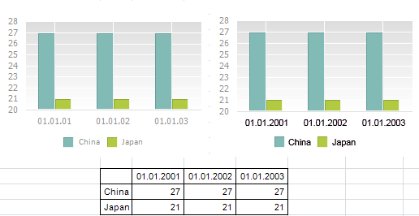

# IPrxChart.SeriesFormatted

IPrxChart.SeriesFormatted
-

# IPrxChart.SeriesFormatted

## Синтаксис

SeriesFormatted: Boolean;

## Описание

Свойство SeriesFormatted
 определяет, использовать ли форматированный текст ячеек для наименований
 рядов диаграммы.

## Комментарии

Под форматированным текстом ячейки понимается формат отображения данных
 ([ITabRange.FormattedText](TabSheet.chm::/Interface/ITabRange/ITabRange.FormattedText.htm)).

Допустимые значения:

	- True. При формировании
	 наименований рядов диаграммы будет использоваться форматированный
	 текст ячеек;

	- False. Будет использоваться
	 неформатированный текст.

## Пример

Для выполнения примера предполагается наличие регламентного отчета с
 идентификатором REPORT, на листе которого настроена диаграмма.

Добавьте ссылки на системные сборки: Metabase, Report, Tab.

	Sub UserProc;

	Var

	    mb: IMetabase;

	    Report: IPrxReport;

	    Tab: ITabSheet;

	    Chart: IPrxChart;

	Begin

	    mb := MetabaseClass.Active;

	    Report := mb.ItemById("REPORT").Edit As IPrxReport;

	    Tab := (Report.ActiveSheet As IPrxTable).TabSheet;

	    Chart := Tab.Objects.Item(0).Extension As IPrxChart;

	    Chart.SeriesFormatted := True;

	    Chart.PointsFormatted := True;

	    (Report As IMetabaseObject).Save;

	End Sub UserProc;

После выполнения примера для диаграммы регламентного отчета будет включена
 опция форматирования текста ячеек для наименований рядов и наименований
 точек диаграммы.

Ниже приведена область данных, для наименований рядов и точек которой
 применено форматирование текста.

Пример наименований диаграммы для представленной области данных с выключенной
 (слева) и включенной (справа) опцией:

См. также:

[IPrxChart](IPrxChart.htm)

		Справочная
		 система на версию 10.9
		 от 18/08/2025,
		 © ООО «ФОРСАЙТ»,
