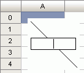

# IPrxShape.EditText

IPrxShape.EditText
-

# IPrxShape.EditText

## Синтаксис

EditText;

## Описание

Метод EditText переводит фигуру
 в режим редактирования текста.

## Пример

Для выполнения примера предполагается наличие формы, расположенной на
 ней кнопки с наименованием «Button1», компонента TabSheetBox
 и компонента UiTabSheet с наименованием
 «UiTabSheet1», являющимся источником данных для TabSheetBox.
 Подключите системные сборки: Report, Tab, Drawing, Forms.

			Sub Button1OnClick(Sender: Object; Args: IMouseEventArgs);

Var

    Tab: ITabSheet;

    TabObj: ITabObject;

    Placement: IGxRectF;

    PrxShape, a: IPrxShape;

Begin

    Tab := UiTabSheet1.TabSheet;

    Placement := New GxRectF.Create(3, 3, 30, 30);

    TabObj := Tab.Objects.Add("PrxShape", Placement);

    PrxShape := TabObj.Extension As IPrxShape;

    PrxShape.Type := PrxShapeType.Link;

    PrxShape.EditText;

End Sub Button1OnClick;

При нажатии на кнопку на листе отчета будет создана линия и переведена
 в режим редактирования текста:

См. также:

[IPrxShape](IPrxShape.htm)

		Справочная
		 система на версию 10.9
		 от 18/08/2025,
		 © ООО «ФОРСАЙТ»,
