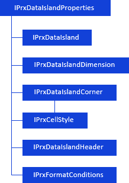
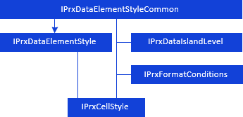
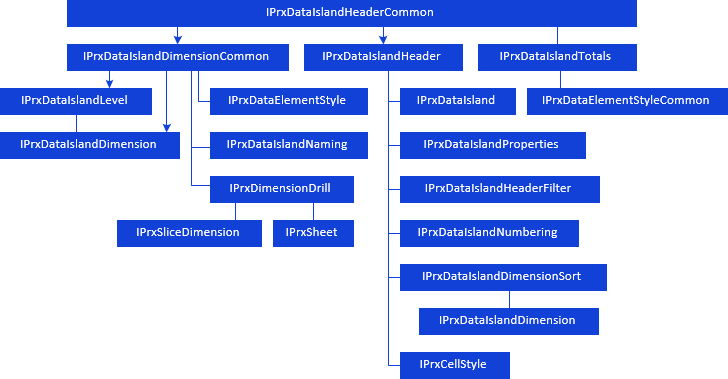
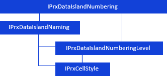
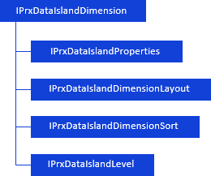
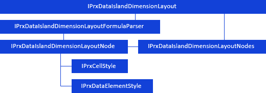

# Настройка области данных

Настройка области данных
-

# Настройка области данных

При работе с [областью данных](KeReport_H_Areas.htm#dataarea)
 доступны настройки:

	- настройка параметров оформления области данных:

[

	- оформление измерений:

	- настройка параметров заголовков области данных, фильтрации и
	 сортировки строк/столбцов, наименований элементов и уровней измерений:

	- настройка нумерации элементов измерений:

	- настройка измерения среза данных, на котором построена область
	 данных:

	- настройка параметров произвольного заголовка измерения:

Примечание.
 Все названия интерфейсов/классов являются гиперссылками, для перехода
 к их подробному описанию щелкните по ним мышью.

## Условные обозначения

		 
		 Класс_1
		 является потомком Интерфейса_1.

		 
		 Интерфейс_2
		 является потомком Интерфейса_1.

		 
		 Интерфейс_2
		 можно получить используя свойства/методы Интерфейса_1.

См. также:

Иерархия
 сборки Report](../../Interface/IPrxDataIslandProperties/IPrxDataIslandProperties.htm) | [Работа с областями
 данных и формул](KeReport_H_Areas.htm)

		Справочная
		 система на версию 10.9
		 от 18/08/2025,
		 © ООО «ФОРСАЙТ»,
