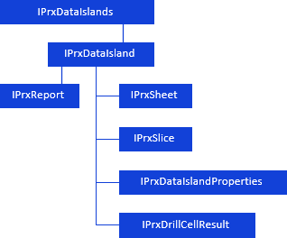
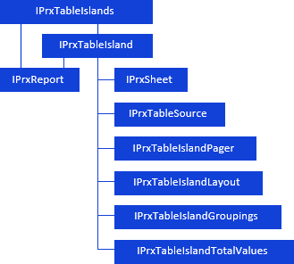
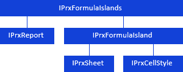

# Работа с областями данных и формул

Работа с областями данных и формул
-

# Работа с областями данных и формул

При работе с регламентным отчетом с помощью сборки Report доступна работа
 со следующими областями:

	- [область данных](#dataarea);

	- [реляционная область данных](#relational_dataarea);

	- [область формул](#formula_area).

## Область данных

Область данных - таблица с данными,
 построенная на основе среза данных.

Для работы с областью данных используйте интерфейсы:

[

Для настройки области данных доступны интерфейсы, приведенные в разделе
 «Настройка области
 данных](../../Interface/IPrxDataIslands/IPrxDataIslands.htm)».

## Реляционная область данных

Реляционная область данных отображает
 данные напрямую из реляционных объектов, таких как таблицы данных, запросы
 и представления.

При работе с реляционными областями данных доступны следующие возможности:

	- фильтрация данных;

	- сортировка данных;

	- произвольная настройка размещения;

	- группировка данных;

	- расчет итоговых значений.

Для работы с реляционной областью данных используйте интерфейсы:

[

Для настройки реляционной области данных доступны интерфейсы, приведенные
 в разделе «Настройка
 реляционной области данных](../../Interface/IPrxTableIslands/IPrxTableIslands.htm)».

## Область формул

Область формул - диапазон ячеек
 на листе отчета, значения которого вычисляются по единой формуле.

В отчете может быть несколько областей формул. Области формул не должны
 пересекаться.

Для работы с областью формул используйте интерфейсы:

[

Примечание.
 Все названия интерфейсов/классов являются гиперссылками, для перехода
 к их подробному описанию щелкните по ним мышью.

## Условные обозначения

		 
		 Класс_1
		 является потомком Интерфейса_1.

		 
		 Интерфейс_2
		 является потомком Интерфейса_1.

		 
		 Интерфейс_2
		 можно получить используя свойства/методы Интерфейса_1.

См. также:

Иерархия
 сборки Report](../../Interface/IPrxFormulaIslands/IPrxFormulaIslands.htm)

		Справочная
		 система на версию 10.9
		 от 18/08/2025,
		 © ООО «ФОРСАЙТ»,
