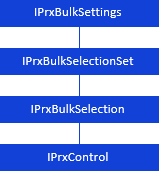

# Пакетные операции

Пакетные операции
-

# Пакетные операции

При работе с регламентным отчетом доступны пакетные операции:

	- пакетный экспорт - экспорт
	 нескольких вариантов отчета. Варианты отчета формируются по отметке
	 фиксированных измерений источника данных;

	- пакетная печать - печать
	 нескольких вариантов отчета, которые формируются по отметке фиксированных
	 измерений.

Для настройки пакетных операций, выполняемых для регламентного отчета,
 используйте интерфейсы:

[

Примечание.
 Все названия интерфейсов/классов являются гиперссылками, для перехода
 к их подробному описанию щелкните по ним мышью.

## Условные обозначения

		 
		 Класс_1
		 является потомком Интерфейса_1.

		 
		 Интерфейс_2
		 является потомком Интерфейса_1.

		 
		 Интерфейс_2
		 можно получить используя свойства/методы Интерфейса_1.

См. также:

Иерархия
 сборки Report](../../Interface/IPrxBulkSettings/IPrxBulkSettings.htm)

		Справочная
		 система на версию 10.9
		 от 18/08/2025,
		 © ООО «ФОРСАЙТ»,
