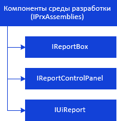
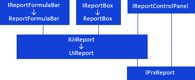

# Работа с объектами и компонентами среды разработки

Работа с объектами и компонентами среды разработки
-

# Работа с объектами и компонентами среды разработки

## Работа с объектами среды
 разработки

При работе с регламентным отчетом доступно подключение к отчету модулей,
 форм репозитория.

Для работы с коллекцией объектов среды разработки, подключенных к регламентному
 отчету, используйте интерфейсы:

[

Объекты среды разработки используются для обработки
 событий отчета](../../Interface/IPrxAssemblies/IPrxAssemblies.htm).

## Работа с компонентами
 среды разработки

Для работы с регламентными отчетами доступны следующие компоненты среды
 разработки:

[

	- ReportBox](../../Interface/IReportBox/IReportBox.htm). Компонент
	 предназначен для отображения данных регламентного отчета;

	- [UiReport](UiDevEnv.chm::/02_Components_constructor_forms/03_Components_of_the_access_to_data/UiReport.htm). Компонент
	 является невизуальным, предназначен для предоставления доступа к данным
	 регламентных отчетов;

	- [ReportControlPanel](UiDevEnv.chm::/02_Components_constructor_forms/03_Components_of_the_access_to_data/ReportControlPanel.htm).
	 Компонент предназначен для отображения панели элементов управления
	 регламентного отчета.

Для работы с компонентами среды разработки используйте интерфейсы:

[

Примечание.
 Все названия интерфейсов/классов являются гиперссылками, для перехода
 к их подробному описанию щелкните по ним мышью.

## Условные обозначения

		 
		 Класс_1
		 является потомком Интерфейса_1.

		 
		 Интерфейс_2
		 является потомком Интерфейса_1.

		 
		 Интерфейс_2
		 можно получить используя свойства/методы Интерфейса_1.

См. также:

Иерархия
 сборки Report](../../Interface/IReportFormulaBar/IReportFormulaBar.htm)

		Справочная
		 система на версию 10.9
		 от 18/08/2025,
		 © ООО «ФОРСАЙТ»,
