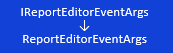

# Наследники IReportEventArgs: IReportEditorEventArgs

Наследники IReportEventArgs: IReportEditorEventArgs
-

# Наследники IReportEventArgs: IReportEditorEventArgs

Интерфейс [IReportEventArgs](../../Interface/IReportEventArgs/IReportEventArgs.htm) является
 базовым для работы с аргументами событий компонента среды разработки [ReportBox](UiDevEnv.chm::/02_Components_constructor_forms/03_Components_of_the_access_to_data/ReportBox.htm).

Наследником интерфейса IReportEventArgs
 является интерфейс:

[

Примечание.
 Все названия интерфейсов/классов являются гиперссылками, для перехода
 к их подробному описанию щелкните по ним мышью.

## Условные обозначения

		 
		 Класс_1
		 является потомком Интерфейса_1.

		 
		 Интерфейс_2
		 является потомком Интерфейса_1.

		 
		 Интерфейс_2
		 можно получить используя свойства/методы Интерфейса_1.

См. также:

Иерархия
 сборки Report](../../Interface/IReportEditorEventArgs/IReportEditorEventArgs.htm) | [Обработка
 событий отчета](KeReport_H_Events.htm#reportbox)

		Справочная
		 система на версию 10.9
		 от 18/08/2025,
		 © ООО «ФОРСАЙТ»,
