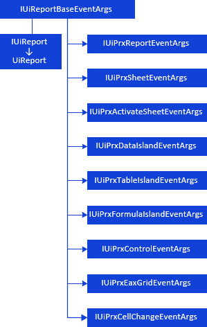
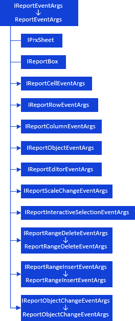
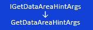

# Обработка событий отчета

Обработка событий отчета
-

# Обработка событий отчета

При работе с регламентными отчетами доступна настройка обработки событий.

Обработчик событий позволяет
 выполнять заданное действие при каждом возникновении события. Например,
 при подключении модуля обработки события появляется возможность:

	- обрабатывать ввод данных «на лету»;

	- выводить диалог подтверждения выполняемого действия;

	- выполнять дополнительные действия перед и/или после возникновения
	 какого-либо события;

	- выводить информационные сообщения, содержащие определенную информацию
	 и др.

Для регламентных отчетов можно настроить обработку событий, происходящих:

	- перед открытием регламентного отчета;

	- перед и после смены активного листа регламентного отчета;

	- перед и после вычисления области данных (в том числе, реляционной),
	 регламентного отчета целиком или его отдельного листа;

	- перед и после печати и/или экспорта регламентного отчета;

	- перед и после сохранения измененных значений областей данных;

	- при изменении значения элемента управления регламентного отчета;

	- перед сохранением регламентного отчета и др.

Для реализации событий регламентного отчета используйте методы интерфейса
 [IPrxReportUserEvents](../../Interface/IPrxReportUserEvents/IPrxReportUserEvents.htm).

## UiReport

Для работы с аргументами событий компонента UiReport
 используйте интерфейсы:

[

## ](../../Interface/IUiReportBaseEventArgs/IUiReportBaseEventArgs.htm)ReportBox

Для работы с аргументами событий компонента ReportBox
 используйте интерфейсы:

[

## ](../../Interface/IReportEventArgs/IReportEventArgs.htm)ReportFormulaBar

Для работы с аргументами события компонента ReportFormulaBar
 используйте интерфейс:

[

Для дальнейшей работы с компонентом среды разработки ReportFormulaBar
 используйте интерфейс IReportFormulaBar](../../Interface/IGetDataAreaHintArgs/IGetDataAreaHintArgs.htm).

Примечание.
 Все названия интерфейсов/классов являются гиперссылками, для перехода
 к их подробному описанию щелкните по ним мышью.

## Условные обозначения

		 
		 Класс_1
		 является потомком Интерфейса_1.

		 
		 Интерфейс_2
		 является потомком Интерфейса_1.

		 
		 Интерфейс_2
		 можно получить используя свойства/методы Интерфейса_1.

См. также:

[Иерархия
 сборки Report](../KeReport_Hierarchy.htm)

		Справочная
		 система на версию 10.9
		 от 18/08/2025,
		 © ООО «ФОРСАЙТ»,
