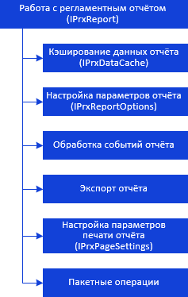
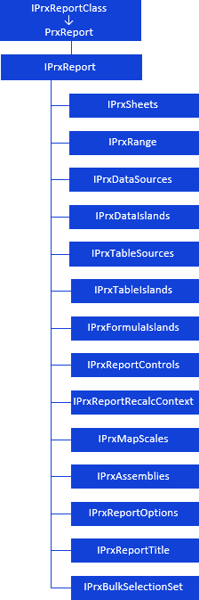
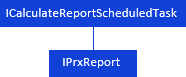

# Общие принципы работы с отчетом

Общие принципы работы с отчетом
-

# Общие принципы работы с отчётом

Общие принципы работы с отчётом можно представить в виде схемы:

[

Для работы с регламентным отчетом и задания его основных параметров
 используйте следующие интерфейсы:

Для определения параметров задачи вычисления регламентного отчета в
 контейнере задач используйте интерфейс:

Для частичной выгрузки отчета в поток с освобождением занимаемой памяти
 используйте интерфейс:

Примечание.
 Все названия интерфейсов/классов являются гиперссылками, для перехода
 к их подробному описанию щелкните по ним мышью.

## Условные обозначения

		 
		 Класс_1
		 является потомком Интерфейса_1.

		 
		 Интерфейс_2
		 является потомком Интерфейса_1.

		 
		 Интерфейс_2
		 можно получить используя свойства/методы Интерфейса_1.

См. также:

Иерархия
 сборки Report](KeReport_H_Export.htm)

		Справочная
		 система на версию 10.9
		 от 18/08/2025,
		 © ООО «ФОРСАЙТ»,
