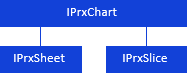
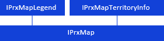
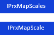
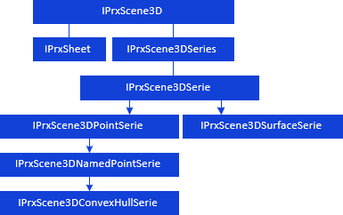

# Размещение объектов на листах отчета

Размещение объектов на листах отчета
-

# Размещение объектов на листах отчета

Кроме размещения на листах отчёта [областей
 данных](KeReport_H_Areas.htm) различных типов, регламентные отчёты поддерживают возможность
 добавления различных объектов.

## Диаграмма

Диаграмма представляет собой
 форму графического отображения табличных данных регламентного отчёта и
 предназначена для их наглядного отображения.

Для работы с диаграммой используйте следующие интерфейсы:

[

Для создания легенды диаграмм как отдельного объекта, не привязанного
 к конкретной диаграмме, используется легенда
 диаграмм. Легенда может включать в себя данные нескольких диаграмм,
 расположенных в отчете.

Для работы с легендой диаграмм используйте следующий интерфейс:

## Карта

Карта представляет собой строку/столбец
 из двумерной таблицы данных в виде закраски территорий. Для сопоставления
 и отображения значений показателей и атрибутов на карте используется легенда карты. Для отображения списка
 территорий карты используется расшифровка
 территорий.

Для работы с картой используйте следующие интерфейсы:

Для оформления различных показателей на картах в регламентном отчёте
 в зависимости от выбранных данных используются шкалы
 отчета.

Для работы со шкалами отчета используйте следующие интерфейсы:

## Визуализаторы

Визуализатор
 представляет собой объект для визуального представления данных. Например:
 карта, диаграмма, таблица и др.

Для работы с визуализатором используйте следующий интерфейс:

## 3D-сцена

3D-сцена служит для представления
 наборов данных в виде различных многомерных объектов: простые и замкнутые
 поверхности, сферы (точки) и группы именованных сфер.

Для работы с 3D-сценой используйте следующие интерфейсы:

## Форматированный текст

Для работы с форматированным текстом используйте интерфейс:

## Рисунок

Регламентные отчёты поддерживают вставку изображений из файлов следующих
 форматов:

	- точечный рисунок Windows (*.bmp, *.dib, *.rle, *.bmz);

	- формат JPEG (*.jpg, *.jpeg, *.jfif, *.jpe);

	- формат GIF (*.gif);

	- формат PNG (*.png);

	- метафайл Windows (*.wmf);

	- расширенный метафайл Windows (*.emf).

Для работы с рисунком используйте следующий интерфейс:

## Фигура

Регламентные отчёты поддерживают вставку следующих фигур:

	- линии;

	- прямоугольники;

	- правильные многоугольники;

	- фигурные стрелки;

	- выноски.

Для работы с фигурой используйте следующий интерфейс:

Примечание.
 Все названия интерфейсов/классов являются гиперссылками, для перехода
 к их подробному описанию щелкните по ним мышью.

## Условные обозначения

		 
		 Класс_1
		 является потомком Интерфейса_1.

		 
		 Интерфейс_2
		 является потомком Интерфейса_1.

		 
		 Интерфейс_2
		 можно получить используя свойства/методы Интерфейса_1.

См. также:

Иерархия
 сборки Report](../../Interface/IPrxChart/IPrxChart.htm)

		Справочная
		 система на версию 10.9
		 от 18/08/2025,
		 © ООО «ФОРСАЙТ»,
