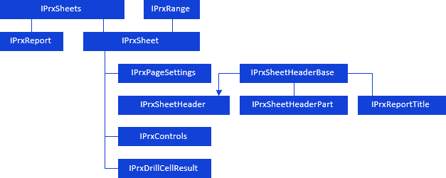
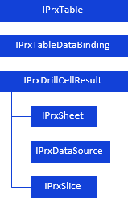

# Работа с листами отчета

Работа с листами отчета
-

# Работа с листами отчёта

Регламентный отчёт состоит из листов с данными. Каждый лист имеет свою вкладку,
 на которой отображено наименование листа. Количество листов в отчёте не
 ограничено.

При работе с листами отчёта доступны следующие операции:

	- добавление нового листа;

	- переименование листа;

	- перемещение листа;

	- поиск листа;

	- удаление листов.

Для работы с листами регламентного отчета и настройки их параметров
 используйте следующие интерфейсы:

[

## ](../../Interface/IPrxSheets/IPrxSheets.htm)Табличный лист

Табличный лист поддерживает представление данных в виде таблиц. Таблица
 состоит из 1048575 столбцов и 1048575 строк, на пересечении которых располагаются
 ячейки таблицы. Значение в числовой ячейке таблицы можно указать в явном
 виде, либо рассчитать по формуле.

Для работы с табличным листом регламентного отчета используйте следующие
 интерфейсы:

[

Примечание.
 Все названия интерфейсов/классов являются гиперссылками, для перехода
 к их подробному описанию щелкните по ним мышью.

## Условные обозначения

		 
		 Класс_1
		 является потомком Интерфейса_1.

		 
		 Интерфейс_2
		 является потомком Интерфейса_1.

		 
		 Интерфейс_2
		 можно получить используя свойства/методы Интерфейса_1.

См. также:

Иерархия
 сборки Report](../../Interface/IPrxTable/IPrxTable.htm)

		Справочная
		 система на версию 10.9
		 от 18/08/2025,
		 © ООО «ФОРСАЙТ»,
