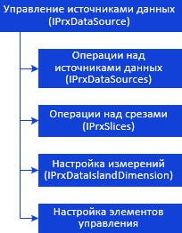
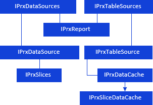
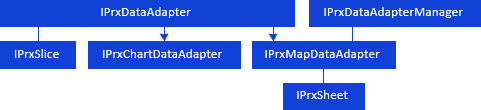
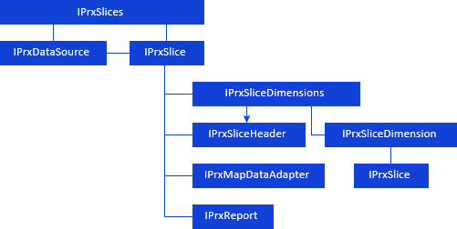

# Управление источниками и срезами данных

Управление источниками и срезами данных
-

# Управление источниками и срезами данных

Работа с источниками и срезами данных происходит в несколько этапов:

	- Выбор и добавление источника Источниками данных регламентного
	 отчета могут являться:

		- все виды кубов, включая дочерние кубы контейнера моделирования;

		- аналитические запросы (OLAP);

		- базы данных временных рядов;

		- переменные моделирования;

		- реляционные объекты (таблицы, запросы, представления,присоединенные
		 таблицы, источники данных ODBC).

	- Добавление среза данных. Для одного источника данных можно добавить
	 несколько срезов. Каждый срез содержит все измерения источника данных,
	 но может располагать их в собственном порядке. Тем самым, в отчете
	 может быть несколько различных представлений одного и того же источника
	 данных.

	- Настройка измерения. Основными задачами при работе с измерениями
	 являются настройка расположения измерения и настройка отметки измерения.

Управление источниками и срезами данных в отчёте можно представить в
 виде схемы:

[

## Работа с источниками данных

Для работы с источниками данных используйте интерфейсы:

Для работы с источниками данных для диаграммы и карты в регламентном
 отчете используйте интерфейсы:

## Работа со срезами источников данных

Для работы со срезами источников данных используйте интерфейсы:

## Сохранение измененных значений области данных в источник

Для проверки наличия измененных значений области данных и их сохранения
 в источник данных используйте интерфейс:

Примечание.
 Все названия интерфейсов/классов являются гиперссылками, для перехода
 к их подробному описанию щелкните по ним мышью.

## Условные обозначения

		 
		 Класс_1
		 является потомком Интерфейса_1.

		 
		 Интерфейс_2
		 является потомком Интерфейса_1.

		 
		 Интерфейс_2
		 можно получить используя свойства/методы Интерфейса_1.

См. также:

Иерархия
 сборки Report](../../Interface/IPrxDataSources/IPrxDataSources.htm)

		Справочная
		 система на версию 10.9
		 от 18/08/2025,
		 © ООО «ФОРСАЙТ»,
