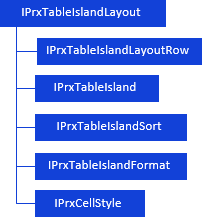
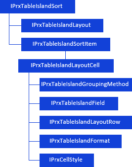
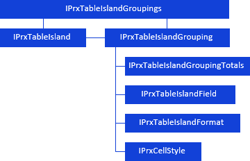
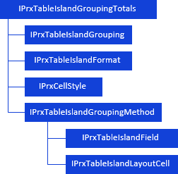
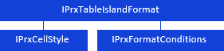

# Настройка реляционной области данных

Настройка реляционной области данных
-

# Настройка реляционной области данных

При работе с [реляционной
 областью данных](KeReport_H_Areas.htm#relational_dataarea) доступны настройки:

	- настройка структуры отображения:

[

	- настройка сортировки в реляционной области данных и параметров
	 ячейки строки отображения:

	- настройка параметров группировки:

	- настройка параметров итогов:

	- настройка параметров оформления:

Примечание.
 Все названия интерфейсов/классов являются гиперссылками, для перехода
 к их подробному описанию щелкните по ним мышью.

## Условные обозначения

		 
		 Класс_1
		 является потомком Интерфейса_1.

		 
		 Интерфейс_2
		 является потомком Интерфейса_1.

		 
		 Интерфейс_2
		 можно получить используя свойства/методы Интерфейса_1.

См. также:

Иерархия
 сборки Report](../../Interface/IPrxCellStyle/IPrxCellStyle.htm) | [Работа с областями
 данных и формул](KeReport_H_Areas.htm)

		Справочная
		 система на версию 10.9
		 от 18/08/2025,
		 © ООО «ФОРСАЙТ»,
