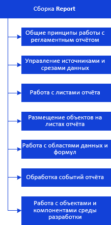

# Иерархия сборки Report

Иерархия сборки Report
-

# Иерархия сборки Report

Все классы и интерфейсы сборки Report
 можно разделить на несколько групп.

[

Примечание.
 Все названия групп приведённой схемы являются гиперссылками, для перехода
 к их подробному описанию щелкните по ним мышью.

См. также:

Введение](KeReport_TitlePage.htm)
 | [Интерфейсы сборки Report](../Interface/KeReport_Interface.htm)
 | [Классы сборки Report](../Class/KeReport_Classes.htm) | [Перечисления сборки Report](../Enums/KeReport_Enums.htm)
 | [Примеры](../Samples/KeReport_Example.htm)

		Справочная
		 система на версию 10.9
		 от 18/08/2025,
		 © ООО «ФОРСАЙТ»,
