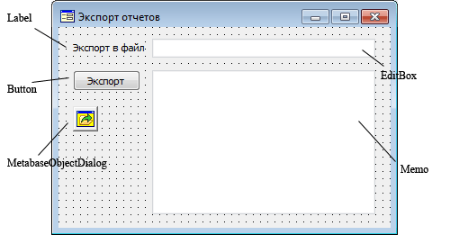
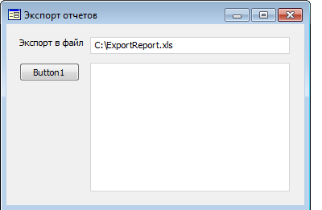
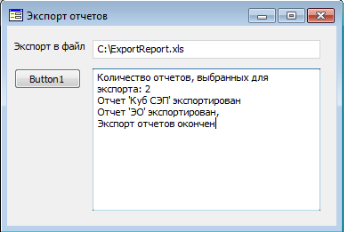

# Экспорт нескольких регламентных отчетов в один файл

Экспорт нескольких регламентных отчетов в один файл
-

# Экспорт нескольких регламентных отчетов в один файл

Ниже рассмотрен пример создания и использования формы для экспорта нескольких
 регламентных отчетов в один файл формата «XLS».

В первую очередь, необходимо создать форму. Далее следует поместить
 на нее компоненты Button, Label, EditBox, MetabaseOpenDialog и Memo следующим
 образом:

Форма должна работать следующим образом: пользователь нажимает кнопку
 «Экспорт», после это отображается диалог открытия объектов репозитория.
 В данном диалоге доступен выбор лишь регламентных отчетов. Если пользователь
 выбрал один или несколько отчетов, то они должны быть экспортированы в
 файл, указанный в компоненте EditBox, в формате «XLS». По умолчанию в
 компоненте EditBox указан файл «C:\ExportReport.xls». Сообщения о ходе
 экспорта должны выводиться в компонент Memo.

Сначала следует запрограммировать событие OnShow
 для формы следующим образом:

	Sub TestFormOnShow(Sender: Object; Args: IEventArgs);

	Begin

	    EditBox1.Text := "C:\ExportReport.xls";

	    Memo1.Lines.Clear;

	End Sub TestFormOnShow;

Далее следует запрограммировать событие OnClick
 для компонента Button следующим образом:

	Sub Button1OnClick(Sender: Object; Args: IMouseEventArgs);

	Var

	    Filter: IMetabaseDialogClassFilter;

	    Objects: IMetabaseObjectDescriptorList;

	    List: IStringList;

	    Exp: PrxReportExporter;

	    i, Count: integer;

	    id: String;

	Begin

	    MetabaseOpenDialog1.MultiSelect := True;

	    // Создание фильтра для диалога открытия объекта репозитория.

	    Filter := New MetabaseDialogClassFilter.Create;

	    Filter.Description := "Регламентные отчеты";

	    // Определяем тип объектов, которые будут отображаться в диалоге

	    // при использовании данного фильтра: регламентный отчет.

	    Filter.ObjectClass := MetabaseObjectClass.KE_CLASS_PROCEDURALREPORT;

	    // Добавляем созданный фильтр в диалог открытия объекта репозитория

	    MetabaseOpenDialog1.Filters.AddFilter(Filter);

	    List := Memo1.Lines;

	    // Очищаем компонент Memo

	    List.Clear;

	    If MetabaseOpenDialog1.Execute(Self) Then

	        // Данные выражения выполняются, если пользователь выбрал один или более регламентный отчет.

	        Objects := MetabaseOpenDialog1.Objects;

	        Count := Objects.Count;

	        List.Add("Количество отчетов, выбранных для экспорта:" + Count.ToString);

	        // Начало пакетного экспорта выбранных отчетов

	        Exp := New PrxReportExporter.Create;

	        Exp.StartBatchCommand(EditBox1.Text, "XLS");

	        For i := 0 To Count - 1 Do

	            id := Objects.Item(i).Id;

	            Exp.Report := MetabaseClass.Active.ItemById(id).Bind As IPrxReport;

	            Exp.ExportToFile("", "XLS");

	            Memo1.Lines.Add("Отчет '" + Objects.Item(i).Name + "' экспортирован");

	        End For;

	        // Окончание пакетного экспорта выбранных отчетов.

	        Exp.FinishBatchCommand;

	        List.Add("Экспорт отчетов окончен");

	    End If;

	End Sub Button1OnClick;

После компиляции, при запуске форма будет выглядеть следующим образом:

Следует нажать кнопку «Экспорт», будет вызван диалог открытия объекта
 репозитория. В нем необходимо выбрать регламентные отчеты для экспорта.
 После этого, будет произведен их экспорт в файл «C:\ExportReport.xls»
 формата «XLS». Сообщения о ходе экспорта будут выведены в компонент Memo:

Примечание.
 Экспорт нескольких отчетов возможен лишь в том случае, если все листы
 имеют различные наименования.

См. также:

[Примеры](KeReport_Example.htm) | [IPrxReportExporter](../Interface/IPrxReportExporter/IPrxReportExporter.htm)

		Справочная
		 система на версию 10.9
		 от 18/08/2025,
		 © ООО «ФОРСАЙТ»,
