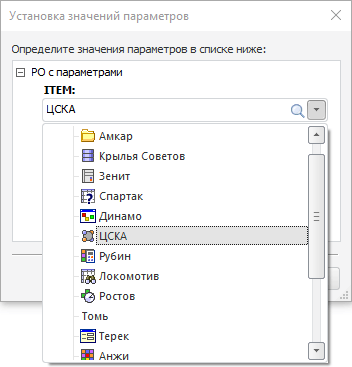

# Редактирование отчета с проверкой типa значения параметра

Редактирование отчета с проверкой типa значения параметра
-

# Редактирование отчета с проверкой типa значения параметра

[Параметры](UiReport.chm::/desktop/Reports/UiReport_Reports_Param.htm)
 принимают значения различных типов. При открытии отчета с типом отображения
 параметра «[Раскрывающийся
 список справочника](UiNav.chm::/GUI/ValueEditorParameters.htm#dimension)» из [Fore](Fore.chm::/Fore_Title.htm) необходимо
 проверять тип значения параметра для работы со значением [элемента управления](uireport.chm::/desktop/source/controls.htm).
 В раскрывающемся списке элемента управления осуществляется как единичная
 отметка, так и множественная. Из-за неточного количества отмеченных элементов
 и несовпадения типов данных может возникнуть ошибка.

Рассмотрим пример открытия регламентного отчета на редактирование с
 проверкой типa значения параметра в виде массива.

Для выполнения примера предполагается наличие регламентного отчета,
 в котором добавлен [параметр
 объекта](UiReport.chm::/desktop/Reports/UiReport_Reports_Param1.htm) с идентификаторм «ITEM» и отображением [раскрывающегося
 списка справочника](UiNav.chm::/GUI/ValueEditorParameters.htm#dimension). Создайте [обработчик
 событий](UiReport.chm::/desktop/reports/event/uireport_reports_event.htm) в модуле Fore. Для события [OnBeforeOpenReport](../Class/ReportEvents/ReportEvents.OnBeforeOpenReport.htm),
 происходящего перед открытием регламентного отчета, добавьте проверку
 типа значения параметра. Подключите системные сборки: Metabase, Report.

			Public Sub OnBeforeOpenReport(Report: IPrxReport; Var Cancel: Boolean);

Var

    Rep: IMetabaseObjectInstance;

    Value: IMetabaseObjectParamValue;

Begin

    Rep := Report.MetabaseObjectInstance;

    If Rep <> Null Then

       Value := Rep.ParamValues.FindById("ITEM");

       (Report.ActiveSheet As IPrxTable).TabSheet.CellValue(0, 0) :=
 Value.IsArray ? "ARRAY!" : Value.Value;

    End If;

End Sub OnBeforeOpenReport;

После выполнения примера, при открытии регламентного отчета, появится
 диалог с выбором параметра в списке заданного справочника:

В первой ячейке регламентного отчета будет отображаться значение выбранного
 параметра.

См. также:

[Примеры](KeReport_Example.htm)

		Справочная
		 система на версию 10.9
		 от 18/08/2025,
		 © ООО «ФОРСАЙТ»,
