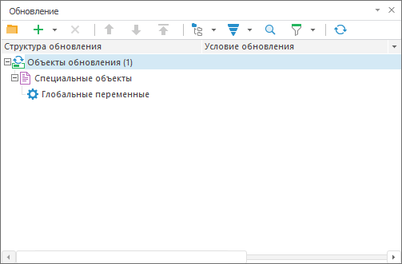

# IMetabaseUpdate.FindSpecialObjectsNode

IMetabaseUpdate.FindSpecialObjectsNode
-

# IMetabaseUpdate.FindSpecialObjectsNode

## Синтаксис

FindSpecialObjectsNode: [IMetabaseUpdateFindSpecialObjectsNode](../IMetabaseUpdateSpecialObjectsNode/IMetabaseUpdateSpecialObjectsNode.htm);

## Описание

Метод FindSpecialObjectsNode осуществляет
 поиск объекта, определяющего параметры обновления специальных объектов.

## Комментарии

Если объект не найден, то возвращается пустое значение и объект не создается.

Для создания нового объекта, определяющего параметры обновления специальных
 объектов, используйте свойство [IMetabaseUpdate.SpecialObjectsNode](IMetabaseUpdate.SpecialObjectsNode.htm).

## Пример

Для выполнения примера предполагается наличие файла обновления Update.pefx.

Добавьте ссылку на системную сборку Metabase.

	Sub Main;

	Var

	    MB: IMetabase;

	    MS: IMetabaseSecurity;

	    Update: IMetabaseUpdate;

	    SpecialObjNode: IMetabaseUpdateSpecialObjectsNode;

	Begin

	    // Получим доступ к репозиторию

	    MB := MetabaseClass.Active;

	    MS := MB.Security;

	    Update := Mb.CreateUpdate;

	    Update.LoadFromFileNF("C:\Update.pefx");

	    // Проверим наличие специального объекта в обновлении

	    SpecialObjNode := Update.FindSpecialObjectsNode;

	    If SpecialObjNode <> Null Then

	        Debug.WriteLine("В обновлении есть специальный объект");

	    Else

	        SpecialObjNode := Update.SpecialObjectsNode;

	        SpecialObjNode.ApplyObject(MetabaseSpecialObject.SharedParams) := True;

	    End If;

	    Update.SaveToFileNF("C:\Update.pefx");

	End Sub Main;

В результате выполнения примера в обновление, загруженное из файла Update.pefx,
 будут добавлены глобальные переменные:

При повторном выполнении в консоль будет выведено сообщение:

В обновлении есть специальный объект

См. также:

[IMetabaseUpdate](IMetabaseUpdate.htm)

		Справочная
		 система на версию 10.9
		 от 18/08/2025,
		 © ООО «ФОРСАЙТ»,
