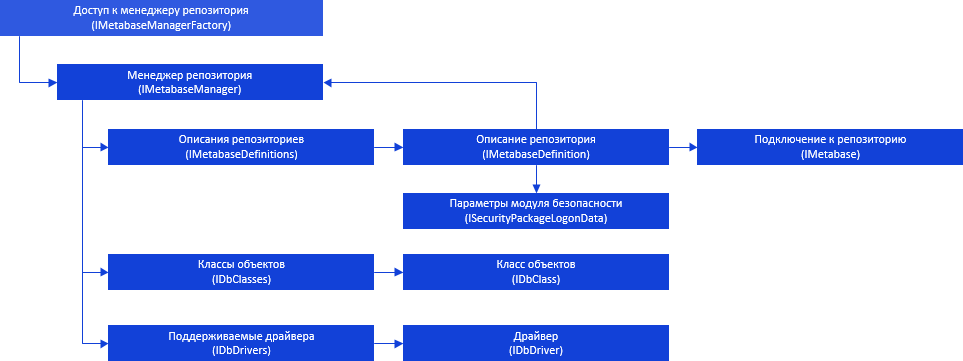
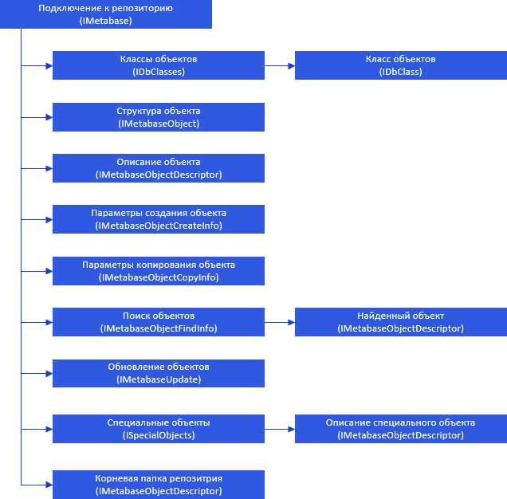

# Менеджер репозитория и подключение

Менеджер репозитория и подключение
-

# Менеджер репозитория и подключение

Для работы с менеджером репозитория и создания подключения к репозиторию
 используются следующие интерфейсы:

[

Подключение с репозиторием описывается интерфейсом IMetabase](../../Interface/IMetabaseManagerFactory/IMetabaseManagerFactory.htm).
 За счёт свойств и методов этого интерфейса осуществляется доступ к различным
 инструментам платформы. Иерархию интерфейсов выглядит следующим образом:

[

Примечание.
 Все названия интерфейсов являются гиперссылками, для перехода к описанию
 щелкните по ним мышью.

## Условные обозначения

		 
		 Класс_1
		 является потомком Интерфейса_1.

		 
		 Интерфейс_2
		 является потомком Интерфейса_1.

		 
		 Интерфейс_2
		 можно получить используя свойства/методы Интерфейса_1.

См. также:

Иерархия
 сборки Metabase](../../Interface/IMetabase/IMetabase.htm)

		Справочная
		 система на версию 10.9
		 от 18/08/2025,
		 © ООО «ФОРСАЙТ»,
