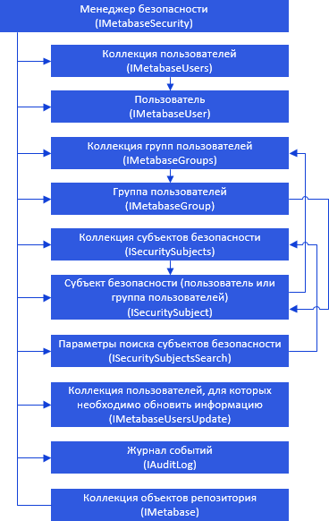
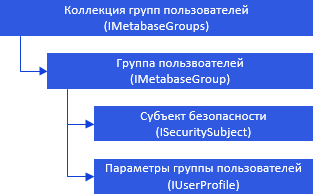
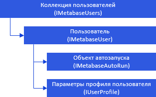
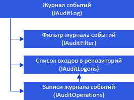

# Работа с менеджером безопасности

Работа с менеджером безопасности
-

# Работа с менеджером безопасности

Для работы с менеджером безопасности используйте интерфейс [IMetabasesecurity](../../Interface/IMetabaseSecurity/IMetabaseSecurity.htm).

[

Иерархия интерфейсов, предназначенных для работы с группами пользователей:

Иерархия интерфейсов, предназначенных для работы с пользователями:

Иерархия интерфейсов, предназначенных для работы с протоколом доступа:

Примечание.
 Все названия интерфейсов являются гиперссылками, для перехода к описанию
 щелкните по ним мышью.

## Условные обозначения

		 
		 Класс_1
		 является потомком Интерфейса_1.

		 
		 Интерфейс_2
		 является потомком Интерфейса_1.

		 
		 Интерфейс_2
		 можно получить используя свойства/методы Интерфейса_1.

См. также:

Иерархия
 сборки Metabase](../../Interface/IMetabaseSecurity/IMetabaseSecurity.htm)

		Справочная
		 система на версию 10.9
		 от 18/08/2025,
		 © ООО «ФОРСАЙТ»,
