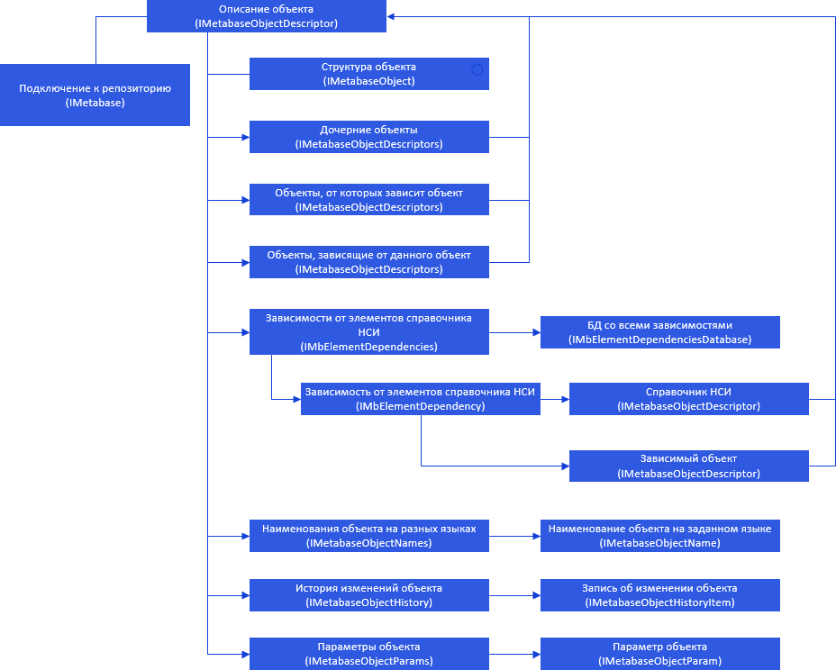
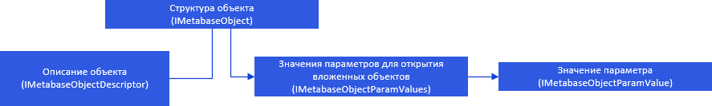
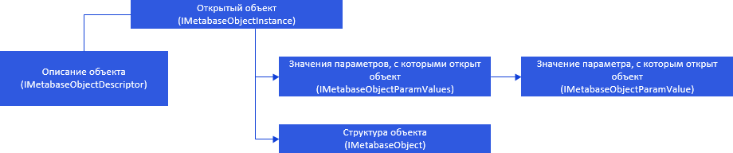

# Объекты репозитория

Объекты репозитория
-

# Объекты репозитория

Каждый объект репозитория имеет описание, для работы с которым используется
 интерфейс [IMetabaseobjectdescriptor](../../Interface/IMetabaseObjectDescriptor/IMetabaseObjectDescriptor.htm).
 Дальнейшая иерархия выглядит следующим образом:

[

Структуру объекта описывает интерфейс IMetabaseobject](../../Interface/IMetabaseObjectDescriptor/IMetabaseObjectDescriptor.htm).
 От данного интерфейса путём приведения типов происходит переход к интерфейсам,
 содержащим специфические настройки объектов репозитория.

[

При открытии объектов для работы с их данными используется интерфейс
 IMetabaseobjectinstance](../../Interface/IMetabaseObject/IMetabaseObject.htm).

[

Примечание.
 Все названия интерфейсов являются гиперссылками, для перехода к описанию
 щелкните по ним мышью.

## Условные обозначения

		 
		 Класс_1
		 является потомком Интерфейса_1.

		 
		 Интерфейс_2
		 является потомком Интерфейса_1.

		 
		 Интерфейс_2
		 можно получить используя свойства/методы Интерфейса_1.

См. также:

Иерархия
 сборки Metabase](../../Interface/IMetabaseObjectInstance/IMetabaseObjectInstance.htm)

		Справочная
		 система на версию 10.9
		 от 18/08/2025,
		 © ООО «ФОРСАЙТ»,
