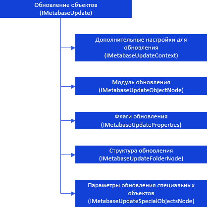

# Создание и установка обновлений

Создание и установка обновлений
-

# Создание и установка обновлений

Для создания обновления, а также для установки обновления в целевом
 репозитории, предназначен интерфейс [IMetabaseupdate](../../Interface/IMetabaseUpdate/IMetabaseUpdate.htm).

[

Примечание.
 Все названия интерфейсов являются гиперссылками, для перехода к описанию
 щелкните по ним мышью.

## Условные обозначения

		 
		 Класс_1
		 является потомком Интерфейса_1.

		 
		 Интерфейс_2
		 является потомком Интерфейса_1.

		 
		 Интерфейс_2
		 можно получить используя свойства/методы Интерфейса_1.

См. также:

Иерархия
 сборки Metabase](../../Interface/IMetabaseUpdate/IMetabaseUpdate.htm)

		Справочная
		 система на версию 10.9
		 от 18/08/2025,
		 © ООО «ФОРСАЙТ»,
