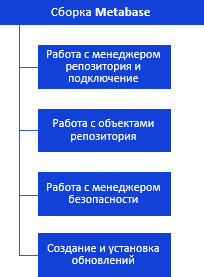

# Иерархия сборки Metabase

Иерархия сборки Metabase
-

# Иерархия сборки Metabase

Все классы и интерфейсы сборки Metabase, в соответствии с выполняемыми
 функциями, можно разделить на несколько групп.

[

Примечание.
 Все названия интерфейсов являются гиперссылками, для перехода к описанию
 щелкните по ним мышью.

См. также:

Введение](../KeSom_Title.htm)
 | [Интерфейсы сборки Metabase](../Interface/KeSom_Interface.htm)
 | [Перечисления
 сборки Metabase](../Enums/KeSom_Enums.htm) | [Классы сборки Metabase](../Class/KeSom_Class.htm)
 | [Примеры](../Examples/Examples_main.htm)

		Справочная
		 система на версию 10.9
		 от 18/08/2025,
		 © ООО «ФОРСАЙТ»,
