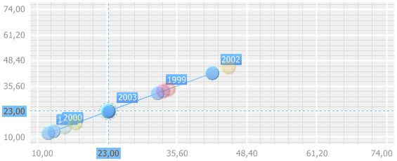

# IVZBubbleChart.ShowBubbleHistory

IVZBubbleChart.ShowBubbleHistory
-

# IVZBubbleChart.ShowBubbleHistory

## Синтаксис

ShowBubbleHistory: Boolean;

## Описание

Свойство ShowBubbleHistory определяет,
 будет ли отображаться история перемещения пузырька диаграммы.

## Комментарии

Допустимые значения:

	- True. История перемещения
	 пузырька диаграммы будет отображаться;

	- False. По умолчанию.
	 История перемещения пузырька отображаться не будет.

## Пример

Для выполнения примера в репозитории необходимо наличие экспресс-отчета
 с идентификатором EXPRESS, содержащего пузырьковую диаграмму.

Добавьте ссылки на системные сборки: Express, Metabase, Visualizators.

	Sub UserProc;

	Var

	    MB: IMetabase;

	    Express: IEaxAnalyzer;

	    BC: IVZBubbleChart;

	Begin

	    // Получим репозиторий

	    MB := MetabaseClass.Active;

	    // Получим экспресс-отчет

	    Express := MB.ItemById("EXPRESS").Edit As IEaxAnalyzer;

	    // Получим пузырьковую диаграмму

	    BC := Express.BubbleChart.BubbleChart;

	    // Включим отображение истории передвижения пузырька

	    BC.ShowBubbleHistory := True;

	    // Включим отображение годовых подсказок

	    BC.ShowBubbleHistoryLabels := True;

	    // Отключим возможность изменения масштаба диаграммы

	    BC.UseZoomOnWheel := False;

	    // Отображение истории при щелчке мыши по пузырьку

	    BC.ShowHistoryMode := VisualizatorHistoryModeEnum.Click;

	    // Отключим включение истории при переходе на другой год

	    If BC.ShowHistoryPreviousStepsOnly Then

	        BC.ShowHistoryPreviousStepsOnly := False;

	    End If;

	    // Обновим пузырьковую диаграмму и обновим отчет

	    Express.BubbleChart.Refresh;

	    (Express As IMetabaseObject).Save;

	End Sub UserProc;

После выполнения примера в экспресс-отчете при щелчке мыши по любому
 пузырьку пузырьковой диаграммы:

	- будет отображаться история перемещения пузырька;

	- будут отображаться годовые подсказки в истории на всех пузырьках
	 ряда.

Например:

См. также:

[IVZBubbleChart](IVZBubbleChart.htm)

		Справочная
		 система на версию 10.9
		 от 18/08/2025,
		 © ООО «ФОРСАЙТ»,
