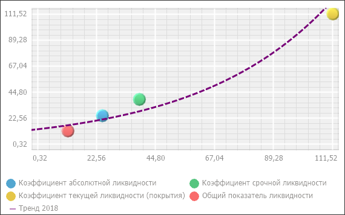

# IVZBubbleChartTrendLine.Name

IVZBubbleChartTrendLine.Name
-

# IVZBubbleChartTrendLine.Name

## Синтаксис

Name: String;

## Описание

Свойство Name определяет пользовательское
 наименование линии тренда в легенде.

## Пример

Для выполнения примера в репозитории необходимо наличие экспресс-отчета
 с идентификатором EXPRESS, содержащего пузырьковую диаграмму.

Добавьте ссылки на системные сборки: Drawing, Express, Metabase, Visualizators.

	Sub UserProc;

	Var

	    MB: IMetabase;

	    Express: IEaxAnalyzer;

	    BC: IVZBubbleChart;

	    TL: IVZBubbleChartTrendLine;

	    Pen: IGxPenBase;

	Begin

	    // Получим репозиторий

	    MB := MetabaseClass.Active;

	    // Получим экспресс-отчет

	    Express := MB.ItemById("EXPRESS").Edit As IEaxAnalyzer;

	    // Получим пузырьковую диаграмму

	    BC := Express.BubbleChart.BubbleChart;

	    // Получим линию тренда

	    TL := BC.TrendLine;

	    // Сделаем линию тренда видимой

	    TL.Visible := True;

	    // Отобразим линию тренда в легенде

	    TL.ShowInLegend := True;

	    // Зададим экспоненциальный тип линии тренда

	    TL.Type := BubbleChartTrendLineType.Exponential;

	    // Переопределим наименование линии тренда в легенде

	    TL.Name := "Тренд 2018";

	    // Создадим перо для линии тренда

	    Pen := New GxPen.CreateSolid(GxColor.FromName("Red"));

	    // Установим пунктирный тип линии

	    Pen.DashStyle := GxDashStyle.Dash;

	    // Зададим новый цвет пера

	    Pen.Color := New GxColor.CreateRGB(120, 0, 120);

	    // Зададим ширину пера

	    Pen.Width := 3;

	    // Зададим новое перо в качестве пера линии тренда

	    TL.Pen := Pen;

	    // Обновим пузырьковую диаграмму и сохраним отчет

	    Express.BubbleChart.Refresh;

	    (Express As IMetabaseObject).Save;

	End Sub UserProc;

После выполнения примера в экспресс-отчете на пузырьковую диаграмму
 будет добавлена линия тренда с заданными параметрами.

Например:

См. также:

[IVZBubbleChartTrendLine](IVZBubbleChartTrendLine.htm)

		Справочная
		 система на версию 10.9
		 от 18/08/2025,
		 © ООО «ФОРСАЙТ»,
