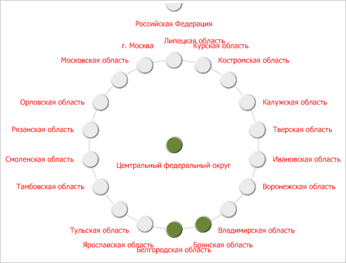
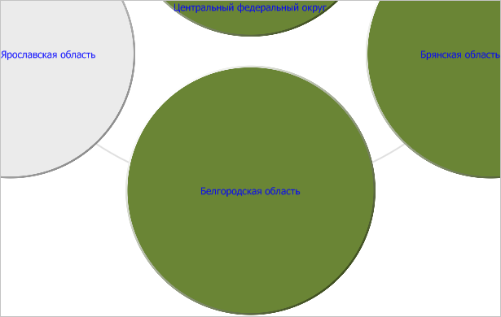

# IVZBubbleTree.Alignment

IVZBubbleTree.Alignment
-

# IVZBubbleTree.Alignment

## Синтаксис

Alignment: [VisualizatorBubbleTreeAlignment](../../Enums/VisualizatorBubbleTreeAlignment.htm);

## Описание

Свойство Alignment определяет
 тип выравнивания элементов в пузырьковом дереве.

## Пример

Для выполнения примера предполагается наличие в репозитории экспресс-отчета
 с идентификатором EXP. Модуль, в котором размещается пример, должен иметь
 ссылки на системные сборки Drawing, Express, Metabase и Visualizators.
 Указанная процедура должна вызываться из точки входа Main.

До выполнения примера пузырьковое дерево выглядит так, как показано
 на странице [описания интерфейса IVZBubbleTree](IVZBubbleTree.htm).
 Установим для элементов дерева выравнивание по верхнему краю, длительность
 анимации пузырьков, равную 3 секундам и второй уровень измерения, по которому
 выбираются данные. Для подписей внутри пузырьков установим голубой цвет,
 а для внешних пузырьков - красный цвет шрифта:

	Sub UserProc;

	Var

	    Metabase: IMetabase;

	    Analyzer: IEaxAnalyzer;

	    BubbleTree: IVZBubbleTree;

	    LabelStyle: IVZLabelStyle;

	    Color: IGxColor;

	Begin

	    // Получим текущий
	 репозиторий

	    Metabase := MetabaseClass.Active;

	    // Получим экспресс-отчёт

	    Analyzer := Metabase.ItemById("EXP").Edit As IEaxAnalyzer;

	    // Получим пузырьковое дерево

	    BubbleTree := Analyzer.BubbleTree.BubbleTree;

	    // Установим выравнивание пузырьков дерева по верхнему краю

	    BubbleTree.Alignment := VisualizatorBubbleTreeAlignment.Top;

	    // Установим длительность анимации, равную 3 секундам

	    BubbleTree.AnimationTime := 3;

	    // Установим новый уровень измерения, по которому выбираются данные

	    BubbleTree.Index := 2;

	    // Установим для подписей внутри пузырьков голубой цвет

	    LabelStyle := New VZLabelStyle.Create;

	    Color := New GxColor.CreateRGB(0, 0, 255);

	    LabelStyle.FontColor := Color;

	    BubbleTree.InnerLabelsStyle := LabelStyle;

	    // Установим для внешних подписей пузырькового дерева красный цвет

	    LabelStyle := New VZLabelStyle.Create;

	    Color := New GxColor.CreateRGB(255, 0, 0);

	    LabelStyle.FontColor := Color;

	    BubbleTree.OuterLabelsStyle := LabelStyle;

	    // Сохраним изменения

	    (Analyzer As IMetabaseObject).Save;

	End Sub UserProc;

В результате выполнения примера для элементов пузырькового дерева было
 установлено выравнивание по верхнему краю, длительность анимации пузырьков,
 равная 3 секундам, второй уровень измерения, по которому выбираются данные,
 а для внешний подписей к пузырькам дерева был задан красный цвет:

Для подписей внутри пузырьков был установлен голубой цвет. Для демонстрации
 данного изменения нажмём на любой доступный пузырёк низшего уровня:

См. также:

[IVZBubbleTree](IVZBubbleTree.htm)

		Справочная
		 система на версию 10.9
		 от 18/08/2025,
		 © ООО «ФОРСАЙТ»,
