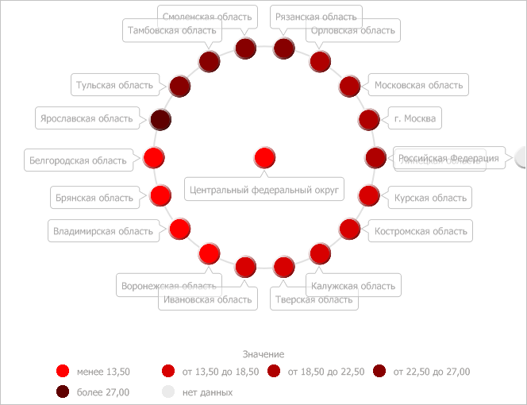

# IVZBubbleTree.ColorVisual

IVZBubbleTree.ColorVisual
-

# IVZBubbleTree.ColorVisual

## Синтаксис

ColorVisual: [IVZColorVisual](../IVZColorVisual/IVZColorVisual.htm);

## Описание

Свойство ColorVisual определяет
 визуализатор сопоставления данных пузырькового дерева цветам заливки их
 дочерних элементов.

## Пример

Для выполнения примера предполагается наличие в репозитории экспресс-отчета
 с идентификатором EXP. В отчете для пузырькового дерева должна быть выбрана
 метрика «Цвет». Модуль, в котором размещается пример, должен иметь ссылки
 на системные сборки Drawing, Express, Metabase и Visualizators. Указанная
 процедура должна вызываться из точки входа Main.

До выполнения примера пузырьковое дерево выглядит так, как показано
 на странице [описания интерфейса IVZBubbleTree](IVZBubbleTree.htm).
 Установим для пузырьков дерева красный цвет заливки разной насыщенности:

	Sub UserProc;

	Var

	    Metabase: IMetabase;

	    EaxAnalyzer: IEaxAnalyzer;

	    BubbleTree: IVZBubbleTree;

	    ColorVisual: IVZColorVisual;

	    ColorMapping: IVZDataSourceMapping;

	    Scale: IVZDataScale;

	    i: Integer;

	    Item: IGxSolidBrush;

	    Color: IGxColor;

	Begin

	    // Получим текущий репозиторий

	    Metabase := MetabaseClass.Active;

	    // Получим экспресс-отчёт

	    EaxAnalyzer := Metabase.ItemById("EXP").Edit As IEaxAnalyzer;

	    // Получим пузырьковое дерево

	    BubbleTree := EaxAnalyzer.BubbleTree.BubbleTree;

	    // Получим визуализатор цвета

	    ColorVisual := BubbleTree.ColorVisual;

	    // Получим настройки сопоставления данных цветам

	    ColorMapping := ColorVisual.ColorMapping;

	    // Получим шкалу цветов

	    Scale := ColorMapping.Scale;

	    // Выполним обход по всем элементам шкалы

	    For i := 0 To Scale.ItemsCount - 1 Do

	        // Получим элемент шкалы

	        Item := Scale.Item(i) As IGxSolidBrush;

	        // Создадим красный цвет

	        Color := New GxColor.CreateRGB(255 - 40 * i, 0, 0);

	        // Установим созданный цвет текущему элементу шкалы

	        Item.Color := Color;

	    End For;

	    // Установим обновлённую шкалу

	    ColorMapping.Scale := Scale;

	    // Сохраним изменения, сделанные в экспресс-отчёте

	    (EaxAnalyzer As IMetabaseObject).Save;

	End Sub UserProc;

В результате выполнения примера пузырьки рассматриваемого дерева были
 окрашены в красный цвет разной интенсивности:

См. также:

[IVZBubbleTree](IVZBubbleTree.htm)

		Справочная
		 система на версию 10.9
		 от 18/08/2025,
		 © ООО «ФОРСАЙТ»,
