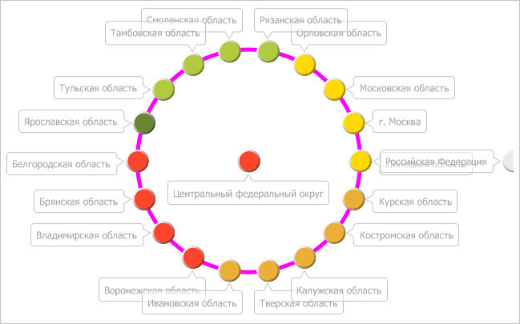

# IVZBubbleTree.OrbitsPen

IVZBubbleTree.OrbitsPen
-

# IVZBubbleTree.OrbitsPen

## Синтаксис

OrbitsPen: [IGxPenBase](ModDrawing.chm::/Interface/IGxPenBase/IGxPenBase.htm);

## Описание

Свойство OrbitsPen определяет
 перо линии орбит в пузырьковом дереве.

## Пример

Для выполнения примера предполагается наличие в репозитории экспресс-отчета
 с идентификатором EXP. Модуль, в котором размещается пример, должен иметь
 ссылки на системные сборки Drawing, Express, Metabase и Visualizators. Указанная
 процедура должна вызываться из точки входа Main.

До выполнения примера пузырьковое дерево выглядит так, как показано
 на странице [описания интерфейса IVZBubbleTree](IVZBubbleTree.htm).
 Окрасим линии орбит в дереве в пурпурный цвет, а также определим количество
 цветов в палитре данной диаграммы:

	Sub UserProc;

	Var

	    Metabase: IMetabase;

	    Analyzer: IEaxAnalyzer;

	    BubbleTree: IVZBubbleTree;

	    OrbitsPen: IGxPenBase;

	    Color: IGxColor;

	    Palette: IVZPalette;

	Begin

	    // Получим текущий репозиторий

	    Metabase := MetabaseClass.Active;

	    // Получим экспресс-отчёт

	    Analyzer := Metabase.ItemById("EXP").Edit As IEaxAnalyzer;

	    // Получим пузырьковое дерево

	    BubbleTree := Analyzer.BubbleTree.BubbleTree;

	    // Создадим перо с заливкой пурпурного цвета

	    Color := New GxColor.CreateRGB(255, 0, 255);

	    OrbitsPen := New GxPen.CreateSolid(Color);

	    // Установим толщину пера

	    OrbitsPen.Width := 5;

	    // Установим созданное перо

	    BubbleTree.OrbitsPen := OrbitsPen;

	    // Получим палитру цветов

	    Palette := BubbleTree.Palette;

	    // Определим количество цветов в палитре

	    Debug.WriteLine("Количество цветов в палитре: " +

	        Palette.BackgroundArray.Count.ToString);

	    // Сохраним изменения, сделанные в экспресс-отчёте

	    (Analyzer As IMetabaseObject).Save;

	End Sub UserProc;

В результате выполнения примера линии орбит в пузырьковом дереве были
 окрашены в пурпурный цвет:

В окне консоли среды разработки было выведено количество цветов в палитре
 пузырькового дерева:

Количество цветов в палитре: 36

См. также:

[IVZBubbleTree](IVZBubbleTree.htm)

		Справочная
		 система на версию 10.9
		 от 18/08/2025,
		 © ООО «ФОРСАЙТ»,
