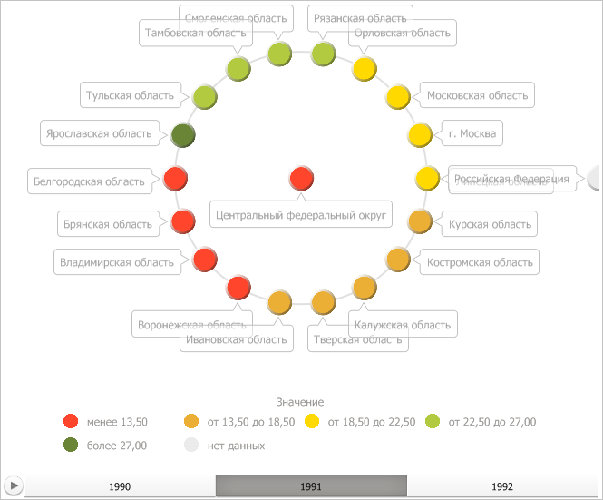

# IVZBubbleTree

IVZBubbleTree
-

# IVZBubbleTree

Сборка: Visualizators;

## Описание

Интерфейс IVZBubbleTree предназначен
 для работы с пузырьковым деревом.

## Иерархия наследования

           [IVZInteractable](../IVZInteractable/IVZInteractable.htm)

           [IVZBaseDataVisualizer](../IVZBaseDataVisualizer/IVZBaseDataVisualizer.htm)

           [IVZDataVisualizer](../IVZDataVisualizer/IVZDataVisualizer.htm)

           [IVZTreeDataVisualizer](../IVZTreeDataVisualizer/IVZTreeDataVisualizer.htm)

           IVZBubbleTree

## Комментарии

Пузырьковое дерево может иметь следующий вид:

Параметры пузырькового дерева могут быть получены в свойстве [IEaxBubbleTree.BubbleTree](KeExpress.chm::/Interface/IEaxBubbleTree/IEaxBubbleTree.BubbleTree.htm).

## Свойства

		 Имя свойства
		 Краткое описание

		 
		 [Alignment](IVZBubbleTree.Alignment.htm)

		 Свойство Alignment
		 определяет тип выравнивания элементов в пузырьковом дереве.

		 
		 [AnimationTime](IVZBubbleTree.AnimationTime.htm)

		 Свойство AnimationTime
		 определяет длительность анимации элементов пузырькового дерева
		 в секундах.

		 
		 [Captions](IVZBubbleTree.Captions.htm)

		 Свойство Captions определяет
		 подписи к элементам пузырькового дерева.

		 
		 [ColorVisual](IVZBubbleTree.ColorVisual.htm)

		 Свойство ColorVisual
		 определяет визуализатор сопоставления данных пузырькового дерева
		 цветам заливки их дочерних элементов.

		 
		 [InnerLabelsStyle](IVZBubbleTree.InnerLabelsStyle.htm)

		 Свойство InnerLabelsStyle
		 определяет стиль подписей внутри элементов пузырькового дерева.

		 
		 [ItemsToolTipStyle](IVZBubbleTree.ItemsToolTipStyle.htm)

		 Свойство ItemsToolTipStyle
		 возвращает объект для работы со стилем всплывающих подсказок.

		 
		 [LabelAutoColor](IVZBubbleTree.LabelAutoColor.htm)

		 Свойство LabelAutoColor
		 определяет, используется ли автоматический цвет шрифта всплывающих
		 подсказок.

		 
		 [OrbitsPen](IVZBubbleTree.OrbitsPen.htm)

		 Свойство OrbitsPen
		 определяет перо линии орбит в пузырьковом дереве.

		 
		 [OuterLabelsStyle](IVZBubbleTree.OuterLabelsStyle.htm)

		 Свойство OuterLabelsStyle
		 определяет стиль внешних подписей для элементов пузырькового дерева.

		 
		 [Palette](IVZBubbleTree.Palette.htm)

		 Свойство Palette определяет
		 палитру цветов пузырькового дерева.

		 
		 [SizeVisual](IVZBubbleTree.SizeVisual.htm)

		 Свойство SizeVisual
		 определяет визуализатор для определения размеров дочерних элементов
		 пузырькового дерева.

		 
		 [TextVisual](IVZBubbleTree.TextVisual.htm)

		 Свойство TextVisual
		 определяет визуализатор текста.

		 
		 [UseItemColorForToolTipBorder](IVZBubbleTree.UseItemColorForToolTipBorder.htm)

		 Свойство UseItemColorForToolTipBorder
		 определяет, будет ли использован цвет элемента для оформления
		 границы всплывающей подсказки при наведении на элемент мышкой.

## Свойства, унаследованные от интерфейса [IVZTreeDataVisualizer](../IVZTreeDataVisualizer/IVZTreeDataVisualizer.htm)

		 Имя свойства
		 Краткое описание

		 
		 [Model](../IVZTreeDataVisualizer/IVZTreeDataVisualizer.Model.htm)

		 Свойство Model определяет
		 модель данных для визуализаторов с древовидной структурой.

См. также:

[Интерфейсы сборки
 Visualizators](../KeVisualizators_Interface.htm)

		Справочная
		 система на версию 10.9
		 от 18/08/2025,
		 © ООО «ФОРСАЙТ»,
