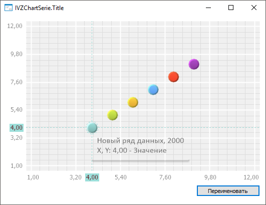

# IVZChartSerie.Title

IVZChartSerie.Title
-

# IVZChartSerie.Title

## Синтаксис

Title: String;

## Описание

Свойство Title определяет заголовок
 ряда данных.

## Пример

Для выполнения примера в репозитории необходимо наличие экспресс-отчёта,
 в котором содержится пузырьковая диаграмма.

Разместите на форме компоненты [Button](UiDevEnv.chm::/02_Components_constructor_forms/01_Standart_Components/Button.htm),
 [UiErAnalyzer](UiDevEnv.chm::/02_Components_constructor_forms/03_Components_of_the_access_to_data/UiErAnalyzer.htm),
 [EaxBubbleChartBox](UiDevEnv.chm::/02_Components_constructor_forms/03_Components_of_the_access_to_data/EaxBubbleChartBox.htm),
 [EditBox](UiDevEnv.chm::/02_Components_constructor_forms/01_Standart_Components/EditBox.htm)
 с наименованиями «Button1», «UiErAnalyzer1», «EaxBubbleChartBox1», «EditBox1»
 соответственно.

Задайте дополнительные свойства:

	- для компонента UiErAnalyzer
	 установите свойству Active
	 значение True и задайте экспресс-отчёт
	 свойству Object;

	- для компонента EaxBubbleChartBox
	 установите свойству Source
	 значение «UiErAnalyzer1»;

	- для компонента Button
	 установите свойству Text значение
	 «Переименовать»;

Добавьте системные сборки: Express, Forms, Visualizators.

Пример является обработчиком события OnClick для компонента «Button1».

	Sub Button1OnClick(Sender: Object; Args: IMouseEventArgs);

	Var

	    BCSource: IEaxBubbleChartSource;

	    EaxBC: IEaxBubbleChart;

	    BubbleChart: IVZBubbleChart;

	    Serie: IVZChartSerie;

	    Series: IVZChartSeries;

	Begin

	    // Получим пузырьковую диаграмму

	    BCSource := EaxBubbleChartBox1.Source;

	    EaxBC := BCSource.GetBubbleChart;

	    BubbleChart := EaxBC.BubbleChart;

	    // Получим ряды данных пузырьковой диаграммы

	    Series := BubbleChart.Series;

	    // Переименуем заголовок
	 первого ряда данных

	    Serie := Series.Item(0);

	    Serie.Title := "Новый ряд данных";

	End Sub Button1OnClick;

После выполнения примера щелкните левой кнопкой мыши на область пузырьковой
 диаграммы и нажмите кнопку «Переименовать».
 В результате чего будет переименован заголовок первого ряда данных, например:

См. также:

[IVZChartSerie](IVZChartSerie.htm)

		Справочная
		 система на версию 10.9
		 от 18/08/2025,
		 © ООО «ФОРСАЙТ»,
