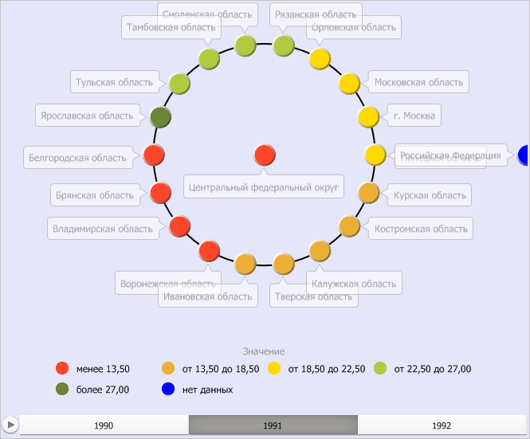

# IVZDataVisualizer.DataMappingToLegendAssignment

IVZDataVisualizer.DataMappingToLegendAssignment
-

# IVZDataVisualizer.DataMappingToLegendAssignment

## Синтаксис

DataMappingToLegendAssignment(legend:
 [IVZLegendBase](../IVZLegendBase/IVZLegendBase.htm)): [IVZDataVisual](../IVZDataVisual/IVZDataVisual.htm);

## Параметры

legend. Объект легенды.

## Описание

Свойство DataMappingToLegendAssignment
 определяет привязку данных дерева к легенде.

## Пример

Для выполнения примера предполагается наличие в репозитории экспресс-отчёта
 с идентификатором EXP. Модуль, в котором размещается пример, должен иметь
 ссылки на системные сборки Express, Metabase, Drawing и Visualizators. Указанная
 процедура должна вызываться из точки входа Main.

До выполнения примера пузырьковое дерево выглядит так, как показано
 на странице [описания интерфейса
 IVZBubbleTree](../IVZBubbleTree/IVZBubbleTree.htm). Установим для данного дерева новый фон, получим коллекцию
 легенд и установим новый цвет шрифта для текстовых элементов легенды.
 Получим визуализатор цвета, установим заливку для пузырька «нет данных»,
 установим визуализатор цвета для легенды. Получим временную шкалу
 и установим новый цвет шрифта для её текстовых элементов. Получим параметры
 пузырькового дерева в формате XML и изменим цвет орбит. Выведем признак
 возможности воспроизведения анимации и признак активности режима печати:

	Sub UserProc;

	Var

	    Metabase: IMetabase;

	    EaxAnalyzer: IEaxAnalyzer;

	    BubbleTree: IVZBubbleTree;

	    Legends: IVZLegends;

	    Legend: IVZLegendBase;

	    TimeLine: IVZTimeLine;

	    BubbleTreeXML: String;

	    DataVisual: IVZColorVisual;

	    Brush: IGxSolidBrush;

	Begin

	    // Получим текущий репозиторий

	    Metabase := MetabaseClass.Active;

	    // Получим экспресс-отчёт

	    EaxAnalyzer := Metabase.ItemById("EXP").Edit As IEaxAnalyzer;

	    // Получим пузырьковое дерево

	    BubbleTree := EaxAnalyzer.BubbleTree.BubbleTree;

	    // Получим коллекцию легенд

	    Legends := BubbleTree.Legends;

	    // Получим легенду из коллекции

	    Legend := Legends.Item(0);

	    // Установим новый цвет шрифта для текстовых элементов легенды

	    Legend.Style.FontColor := New GxColor.CreateRGB(0, 0, 0);

	    // Получим визуализатор цвета

	    DataVisual := BubbleTree.ColorVisual;

	    // Установим заливку для пузырька «нет данных»

	    Brush := DataVisual.ColorMapping.Data("") As IGxSolidBrush;

	    If Brush <> Null Then

	        Brush.Color := New GxColor.CreateRGB(0, 0, 255);

	    End If;

	    // Установим визуализатор цвета для легенды

	    BubbleTree.DataMappingToLegendAssignment(Legend) := DataVisual.ColorMapping;

	    // Получим временную шкалу

	    Timeline := BubbleTree.TimeLine;

	    // Установим новый цвет шрифта для текстовых элементов временной шкалы

	    Timeline.Style.FontColor := New GxColor.CreateRGB(0, 0, 0);

	    // Изменим цвет орбит

	    BubbleTree.OrbitsPen.Color := New GxColor.CreateARGB(255,0,0,0);

	    // Сохраним экспресс-отчёт

	    (EaxAnalyzer As IMetabaseObject).Save;

	End Sub UserProc;

В результате выполнения примера был установлен новый цвет шрифта для
 текстовых элементов легенды и временной шкалы, был изменён цвет пузырька,
 в котором отсутствуют данные, был изменён цвет орбит:

Также в консоли среды разработки был выведен признак возможности воспроизведения
 анимации и признак активности режима печати:

Признак возможности воспроизведения анимации: True

Признак активности режима печати: False

См. также:

[IVZDataVisualizer](IVZDataVisualizer.htm)

		Справочная
		 система на версию 10.9
		 от 18/08/2025,
		 © ООО «ФОРСАЙТ»,
