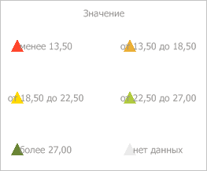

# IVZIntervalsLegend.CellSpacing

IVZIntervalsLegend.CellSpacing
-

# IVZIntervalsLegend.CellSpacing

## Синтаксис

CellSpacing: [IGxSizeF](moddrawing.chm::/Interface/IGxSizeF/IGxSizeF.htm);

## Описание

Свойство CellSpacing определяет
 горизонтальный и вертикальный отступы элементов внутри легенды с интервалами.

## Комментарии

Для определения области легенды визуализатора, в которой будут находиться
 пункты, используйте [IVZIntervalsLegend.CellPadding](IVZIntervalsLegend.CellPadding.htm).

## Пример

Для выполнения примера предполагается наличие в репозитории экспресс-отчёта
 с идентификатором EXP. Модуль, в котором размещается пример, должен иметь
 ссылки на системные сборки Express, Drawing, Metabase и Visualizators.
 Указанная процедура должна вызываться из точки входа Main.

До выполнения примера легенда с интервалами у пузырькового дерева выглядит
 так, как показано на странице [описания
 интерфейса IVZDataScale](../IVZDataScale/IVZDataScale.htm). Установим для данной легенды маркер треугольной
 формы, горизонтальные и вертикальные отступы, равные 50 пикселям, а также
 выравнивание их подписей по центру с отступом в -20 пикселей. Сами элементы
 расположим в два столбца:

	Sub UserProc;

	Var

	    Metabase: IMetabase;

	    EaxAnalyzer: IEaxAnalyzer;

	    BubbleTree: IVZBubbleTree;

	    Legend: IVZIntervalsLegend;

	    CellSpacing: IGxSizeF;

	Begin

	    // Получим текущий репозиторий

	    Metabase := MetabaseClass.Active;

	    // Получим экспресс-отчёт

	    EaxAnalyzer := Metabase.ItemById("EXP").Edit As IEaxAnalyzer;

	    // Получим пузырьковое дерево

	    BubbleTree := EaxAnalyzer.BubbleTree.BubbleTree;

	    // Получим легенду

	    Legend := BubbleTree.Legends.Item(0) As IVZIntervalsLegend;

	    // Установим элементы легенды треугольной формы

	    Legend.Marker.Marker := VisualizatorSizeMarkerShape.Trapezoid;

	    // Установим отступы между элементами, равные 50 пикселям

	    CellSpacing := New GxSizeF.Create(50, 50);

	    Legend.CellSpacing := CellSpacing;

	    // Установим отступ текста внутри элемента

	    Legend.TextSpacing := -20;

	    // Установим горизонтальное выравнивание подписи по центру элемента

	    Legend.TextHorizontalAlignment := GxStringAlignment.Center;

	    // Расположим элементы легенды в два столбца

	    Legend.ColumnsCount := 2;

	    // Сохраним сделанные изменения в экспресс-отчёте

	    (EaxAnalyzer As IMetabaseObject).Save;

	End Sub UserProc;

В результате выполнения примера для элементов легенды пузырькового дерева
 был установлен маркер треугольной формы, горизонтальные и вертикальные
 отступы, равные 50 пикселям. Выравнивание их подписей было выполнено по
 центру с отступом в -20 пикселей, а сами элементы были расположены в два
 столбца:

См. также:

[IVZIntervalsLegend](IVZIntervalsLegend.htm)

		Справочная
		 система на версию 10.9
		 от 18/08/2025,
		 © ООО «ФОРСАЙТ»,
