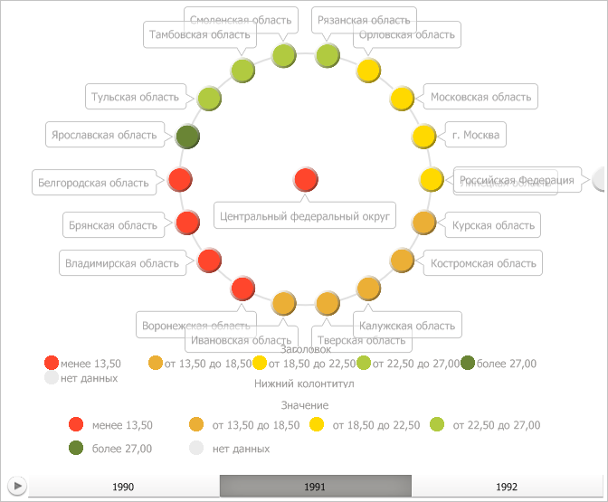

# IVZLegends.Add

IVZLegends.Add
-

# IVZLegends.Add

## Синтаксис

Add(Value: [IVZLegendBase](../IVZLegendBase/IVZLegendBase.htm)):
 Integer;

## Параметры

Value. Легенда, добавляемая
 в коллекцию.

## Описание

Метод Add добавляет указанную
 легенду в коллекцию легенд визуализатора.

## Комментарии

Метод возвращает индекс добавленной легенды в коллекции.

Для того чтобы легенда была отображена в визуализаторе, необходимо указать
 значения для её свойств. Так, например, для цветовой легенды обязательные
 свойства следующие:

	- [IVZColorLegendBase.BetweenFormat](../IVZColorLegendBase/IVZColorLegendBase.BetweenFormat.htm);

	- [IVZColorLegendBase.GreaterFormat](../IVZColorLegendBase/IVZColorLegendBase.GreaterFormat.htm);

	- [IVZColorLegendBase.LessFormat](../IVZColorLegendBase/IVZColorLegendBase.LessFormat.htm);

	- [IVZColorLegendBase.NoDataText](../IVZColorLegendBase/IVZColorLegendBase.NoDataText.htm);

	- [IVZColorLegendBase.Scale](../IVZColorLegendBase/IVZColorLegendBase.Scale.htm);

	- [IVZPlacedControlBase.Style](../IVZPlacedControlBase/IVZPlacedControlBase.Style.htm).

## Пример

Для выполнения примера предполагается наличие в репозитории экспресс-отчёта
 с идентификатором EXP. Модуль, в котором размещается пример, должен иметь
 ссылки на системные сборки Drawing, Express, Metabase и Visualizators.
 Указанная процедура должна вызываться из точки входа Main.

До выполнения примера пузырьковое дерево выглядит так, как показано
 на странице [описания интерфейса
 IVZBubbleTree](../IVZBubbleTree/IVZBubbleTree.htm). Далее создадим легенду с интервалами, не уменьшающую
 рабочую область пузырькового дерева. Для всех обязательных её свойств
 укажем значения из соответствующих свойств цветовой легенды, а также установим
 заголовок и нижний колонтитул. Затем добавим данную легенду на диаграмму:

	Sub UserProc;

	Var

	    Metabase: IMetabase;

	    Analyzer: IEaxAnalyzer;

	    BubbleTree: IVZBubbleTree;

	    ColorLegend: IVZColorLegendBase;

	    IntervalsLegend: IVZIntervalsLegend;

	Begin

	    // Получим текущий репозиторий

	    Metabase := MetabaseClass.Active;

	    // Получим экспресс-отчёт

	    Analyzer := Metabase.ItemById("EXP").Edit As IEaxAnalyzer;

	    // Получим пузырьковое дерево

	    BubbleTree := Analyzer.BubbleTree.BubbleTree;

	    // Получим цветовую легенду дерева

	    ColorLegend := BubbleTree.Legends.Item(0) As IVZColorLegendBase;

	    // Создадим новую легенду

	    IntervalsLegend := New VZIntervalsLegend.Create;

	    // Зададим цветовую шкалу

	    IntervalsLegend.Scale := ColorLegend.Scale;

	    // Зададим форматы подписей к интервалам шкалы

	    IntervalsLegend.BetweenFormat := ColorLegend.BetweenFormat;

	    IntervalsLegend.GreaterFormat := ColorLegend.GreaterFormat;

	    IntervalsLegend.LessFormat := ColorLegend.LessFormat;

	    // Укажем стиль легенды

	    IntervalsLegend.Style := ColorLegend.Style;

	    // Укажем стиль для пузырька, соответствующего отсутствующим данным

	    IntervalsLegend.NoDataText := ColorLegend.NoDataText;

	    // Установим заголовок легенды

	    IntervalsLegend.Header := ColorLegend.Header;

	    IntervalsLegend.Header.Text := "Заголовок";

	    // Установим нижний колонтитул легенды

	    IntervalsLegend.Footer := ColorLegend.Header;

	    IntervalsLegend.Footer.Text := "Нижний колонтитул";

	    IntervalsLegend.Footer.Style.Alignment := GxStringAlignment.Near;

	    // Легенда не будет уменьшать область пузырькового дерева

	    IntervalsLegend.IsOverlap := True;

	    // Добавим данную легенду на диаграмму

	    BubbleTree.Legends.Add(IntervalsLegend);

	    Debug.WriteLine("Общее количество легенд: " + BubbleTree.Legends.Count.ToString);

	    // Сохраним изменения, сделанные в экспресс-отчёте

	    (Analyzer As IMetabaseObject).Save;

	End Sub UserProc;

В результате выполнения примера была создана легенда с интервалами,
 не уменьшающая рабочую область пузырькового дерева. Для всех обязательных
 её свойств были указаны значения из соответствующих свойств цветовой легенды,
 а также был установлен заголовок и нижний колонтитул. Затем данная легенда
 была добавлена на диаграмму:

В окне консоли среды разработки было выведено общее количество легенд
 в пузырьковом дереве:

Общее количество легенд: 2

См. также:

[IVZLegends](IVZLegends.htm)

		Справочная
		 система на версию 10.9
		 от 18/08/2025,
		 © ООО «ФОРСАЙТ»,
