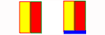

# IVZMapChartBarAxis

IVZMapChartBarAxis
-

# IVZMapChartBarAxis

Сборка: Visualizators;

## Описание

Интерфейс IVZMapChartBarAxis
 используется для работы с осью [столбикового показателя](UiMaps.chm::/Configure/Diagrams.htm)
 на слое карты.

## Иерархия наследования

           IVZMapChartBarAxis

## Комментарии

У столбиков с отрицательными значениями ось будет расположена сверху,
 у столбиков с положительными значениями - снизу.

Столбиковый показатель без оси и с осью:

Для определения оси столбикового показателя на слое карты используйте
 [IVZMapChartBar.Axis](../IVZMapChartBar/IVZMapChartBar.Axis.htm).

## Свойства

		 Имя свойства
		 Краткое описание

		 
		 [Pen](IVZMapChartBarAxis.Pen.htm)

		 Свойство Pen определяет
		 базовые настройки пера оси [столбикового показателя](UiMaps.chm::/Configure/Diagrams.htm)
		 на слое карты.

		 
		 [Visibility](IVZMapChartBarAxis.Visibility.htm)

		 Свойство Visibility определяет
		 тип видимости оси [столбикового показателя](UiMaps.chm::/Configure/Diagrams.htm)
		 на слое карты.

См. также:

[Интерфейсы сборки
 Visualizators](../KeVisualizators_Interface.htm)

		Справочная
		 система на версию 10.9
		 от 18/08/2025,
		 © ООО «ФОРСАЙТ»,
