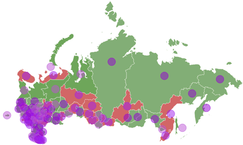

# IVZMapChartBubble

IVZMapChartBubble
-

# IVZMapChartBubble

Сборка: Visualizators;

## Описание

Интерфейс IVZMapChartBar используется
 для работы с пузырьковым показателем на слое карты.

## Иерархия наследования

           [IVZMapChartBaseObject](../IVZMapChartBaseObject/IVZMapChartBaseObject.htm)

           [IVZMapChartVisualElement](../IVZMapChartVisualElement/IVZMapChartVisualElement.htm)

           IVZMapChartBar

## Комментарии

Пузырьковый показатель позволяет
 отобразить дополнительную информацию о территориях, например соотношение
 значений показателя.

Для включения данного вида показателей используйте настройку в реестре:
 [HKEY_CURRENT_USER\Software\Foresight\Foresight Analytics Platform\10.0\Visualizers\MapChart\EnableBubbleIndicator]
 = 1. Если конечного раздела «MapChart»
 и параметра EnableBubbleIndicator =1»
 типа REG_DWORD нет в реестре, то создайте их вручную.

Работа с пузырьковыми показателями осуществляется по тому же принципу,
 что и с [круговыми показателями](../IVZPiesArray/IVZPiesArray.htm).

Пример карты с пузырьковыми показателями:

Для получения объектов для работы с пузырьковыми показателями необходимо:

	- Получить слой
	 карты с помощью IVZMapChartLayers.Item.

	- Получить
	 массив пузырьковых показателей с помощью [IVZMapChartLayer.Bubbles](../IVZMapChartLayer/IVZMapChartLayer.Bubbles.htm).

	- Получить
	 пузырьковый показатель с помощью [IVZBubblesArray.Item](../IVZBubblesArray/IVZBubblesArray.Item.htm).

В результате выполнения действий будет доступна работа с пузырьковым
 показателем на слое карты.

## Свойства

		 Имя свойства
		 Краткое описание

		 
		 [LeastSizeRadius](IVZMapChartBubble.LeastSizeRadius.htm)
		 Свойство LeastSizeRadius
		 определяет минимальное значение радиуса пузырькового показателя
		 на слое карты.

## Свойства, унаследованные от [IVZMapChartVisualElement](../IVZMapChartVisualElement/IVZMapChartVisualElement.htm)

		 Имя свойства
		 Краткое описание

		 
		 [ToolTipStyle](../IVZMapChartVisualElement/IVZMapChartVisualElement.ToolTipStyle.htm)
		 Свойство ToolTipStyle
		 определяет стиль всплывающих подсказок визуального элемента на
		 карте.

## Свойства, унаследованные от [IVZMapChartBaseObject](../IVZMapChartBaseObject/IVZMapChartBaseObject.htm)

		 Имя свойства
		 Краткое описание

		 
		 [MapChart](../IVZMapChartBaseObject/IVZMapChartBaseObject.MapChart.htm)
		 Свойство MapChart возвращает
		 объект, содержащий параметры отображения карты в экспресс-отчёте.

		 
		 [Visible](../IVZMapChartBaseObject/IVZMapChartBaseObject.Visible.htm)
		 Свойство Visible определяет,
		 будет ли отображаться объект на карте.

См. также:

[Интерфейсы сборки
 Visualizators](../KeVisualizators_Interface.htm)

		Справочная
		 система на версию 10.9
		 от 18/08/2025,
		 © ООО «ФОРСАЙТ»,
