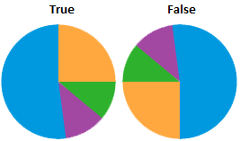

# IVZMapChartPie.UseInvertedAngles

IVZMapChartPie.UseInvertedAngles
-

# IVZMapChartPie.UseInvertedAngles

## Синтаксис

UseInvertedAngles: Boolean;

## Описание

Свойство UseInvertedAngles определяет
 признак отображения секторов [кругового показателя](UiMaps.chm::/Configure/Diagrams.htm)
 на карте в обратную сторону.

## Комментарии

Допустимые значения:

	- True. Секторы будут
	 отображаться в обратную сторону;

	- False. По умолчанию.
	 Секторы не будут отображаться в обратную сторону.

Например:

## Пример

Для выполнения примера в репозитории необходимо наличие экспресс-отчёта
 с идентификатором EXPRESS_REPORT. Отчёт содержит карту. На карте отображаются
 круговые показатели и две стрелки, выходящие из одного региона. Для отображения
 круговых показателей на карте:

	- В измерении «Факты»
	 установите переключатель «Круговой».

	- Отметьте элементы «Значение»
	 и «Измерение».

Для работы со стрелками ознакомьтесь с [требованиями для
 отображения стрелок](UiMaps.chm::/Common/Arrows_requirements.htm).

Добавьте ссылки на системные сборки: Express, Metabase, Visualizators.

	Sub UserProc;

	Var

	    Metabase: IMetabase;

	    EaxAnalyzer: IEaxAnalyzer;

	    EMap: IVZMapChart;

	    MapPie: IVZMapChartPie;

	Begin

	    // Получим текущий репозиторий

	    Metabase := MetabaseClass.Active;

	    // Получим экспресс-отчёт

	    EaxAnalyzer := Metabase.ItemById("EXPRESS_REPORT").Edit As IEaxAnalyzer;

	    // Получим карту экспресс-отчёта в качестве визуализатора

	    EMap := EaxAnalyzer.MapChart.MapChart;

	    // Определим режим подсветки стрелок карты по территории-источнику

	    EMap.ArrowEffectsMode := MapChartArrowEffectsMode.StartShape;

	    // Получим круговой показатель

	    MapPie := EMap.RootLayer.SubLayers.Item(0).Pies.Item(0);

	    // Если отключена видимость показателя, то включим её

	    If Not MapPie.Visible Then

	        MapPie.Visible := True;

	    End If;

	    // Отобразим углы показателей в обратную сторону

	    MapPie.UseInvertedAngles := True;

	    // Зададим минимальный угол секторов показателей

	    MapPie.LeastAnglePart := 150;

	    // Сохраним изменения

	    (EaxAnalyzer As IMetabaseObject).Save;

	End Sub UserProc;

После выполнения примера изменится минимальный угол секторов показателей,
 секторы показателей будут отображаться в обратную сторону, для стрелок
 будет установлен режим подсветки по территории-источнику (будут подсвечиваться
 все стрелки, выходящие из региона, на который наведён курсор мыши).

См. также:

[IVZMapChartPie.UseInvertedAngles](IVZMapChartPie.UseInvertedAngles.htm)

		Справочная
		 система на версию 10.9
		 от 18/08/2025,
		 © ООО «ФОРСАЙТ»,
