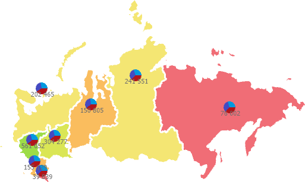

# IVZPiesArray

IVZPiesArray
-

# IVZPiesArray

Сборка: Visualizators;

## Описание

Интерфейс IVZPiesArray используется
 для работы с массивом круговых показателей на слое карты.

## Иерархия наследования

           IVZPiesArray

## Комментарии

Круговой показатель позволяет
 отобразить дополнительную информацию о территориях, например соотношение
 значений показателя.

Для получения массива круговых показателей на слое карты используйте
 свойство [IVZMapChartLayer.Pies](../IVZMapChartLayer/IVZMapChartLayer.Pies.htm).

Пример отображения круговых показателей на карте:

Для получения подробной информации об отображении круговых показателей
 на карте обратитесь к разделу «[Отображение диаграмм](UiMaps.chm::/Configure/Diagrams.htm)».

## Свойства

		 Имя свойства
		 Краткое описание

		 
		 [Count](IVZPiesArray.Count.htm)
		 Свойство Count возвращает
		 количество круговых показателей в коллекции на слое карты.

		 
		 [Item](IVZPiesArray.Item.htm)
		 Свойство Item возвращает
		 круговой показатель по его индексу.

## Методы

		 Имя метода
		 Краткое описание

		 
		 [Add](IVZPiesArray.Add.htm)
		 Метод Add добавляет
		 указанный круговой показатель в коллекцию на слое карты.

		 
		 [Clear](IVZPiesArray.Clear.htm)
		 Метод Clear очищает
		 коллекцию круговых показателей на слое карты.

		 
		 [InsertAt](IVZPiesArray.InsertAt.htm)
		 Метод InsertAt вставляет
		 указанный круговой показатель в указанную позицию в коллекции.

		 
		 [Remove](IVZPiesArray.Remove.htm)
		 Метод Remove удаляет
		 круговой показатель из коллекции по его индексу.

См. также:

[Интерфейсы сборки
 Visualizators](../KeVisualizators_Interface.htm)

		Справочная
		 система на версию 10.9
		 от 18/08/2025,
		 © ООО «ФОРСАЙТ»,
