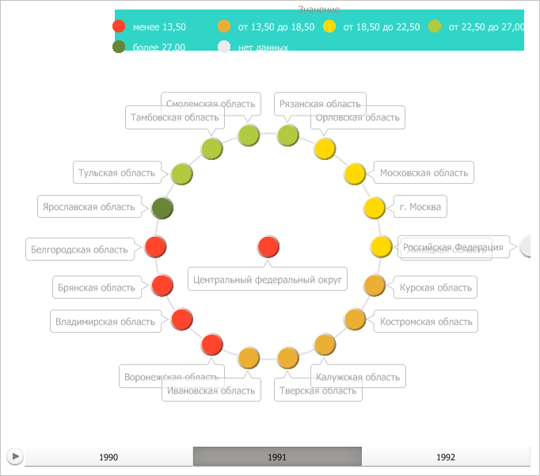

# IVZPlacedControlBase.Style

IVZPlacedControlBase.Style
-

# IVZPlacedControlBase.Style

## Синтаксис

Style: [IVZControlStyle](../IVZControlStyle/IVZControlStyle.htm);

## Описание

Свойство Style определяет стиль
 для элемента управления.

## Пример

Для выполнения примера предполагается наличие в репозитории экспресс-отчёта
 с идентификатором EXP. Модуль, в котором размещается пример, должен иметь
 ссылки на системные сборки Drawing, Express, Metabase и Visualizators. Указанная
 процедура должна вызываться из точки входа Main.

До выполнения примера пузырьковое дерево выглядит так, как показано
 на странице [описания интерфейса
 IVZBubbleTree](../IVZBubbleTree/IVZBubbleTree.htm). Установим для легенды с интервалами пузырькового дерева
 выравнивание по верхней и правой границе и применим заливку бирюзового
 цвета:

	Sub UserProc;

	Var

	    Metabase: IMetabase;

	    Analyzer: IEaxAnalyzer;

	    BubbleTree: IVZBubbleTree;

	    Style: IVZControlStyle;

	    Brush: IGxSolidBrush;

	    Legend: IVZIntervalsLegend;

	Begin

	    // Получим текущий репозиторий

	    Metabase := MetabaseClass.Active;

	    // Получим экспресс-отчёт

	    Analyzer := Metabase.ItemById("EXP").Edit As IEaxAnalyzer;

	    // Получим пузырьковое дерево

	    BubbleTree := Analyzer.BubbleTree.BubbleTree;

	    // Получим легенду с интервалами

	    Legend := BubbleTree.Legends.Item(0) As IVZIntervalsLegend;

	    // Установим горизонтальное выравнивание легенды

	    Legend.HorizontalAlignment := VisualizatorHorizontalAlignment.Right;

	    // Установим вертикальное выравнивание легенды

	    Legend.VerticalAlignment := VisualizatorVerticalAlignment.Top;

	    // Определим стиль легенды с заливкой бирюзового цвета

	    Style := New VZControlStyle.Create;

	    Brush := New GxSolidBrush.Create(New GxColor.CreateRGB(48, 213, 200));

	    Style.Background := Brush;

	    Legend.Style := Style;

	    // Сохраним изменения, сделанные в экспресс-отчёте

	    (Analyzer As IMetabaseObject).Save;

	End Sub UserProc;

В результате выполнения примера легенда с интервалами пузырькового дерева
 была выравнена по верхней и правой границе. Также для неё была применена
 заливка бирюзового цвета:

См. также:

[IVZPlacedControlBase](IVZPlacedControlBase.htm)

		Справочная
		 система на версию 10.9
		 от 18/08/2025,
		 © ООО «ФОРСАЙТ»,
