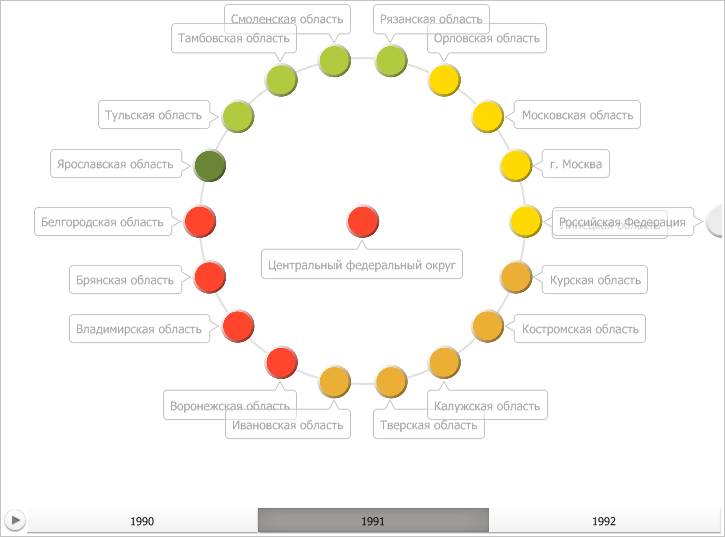

# IVZPlacedControlBase.Visible

IVZPlacedControlBase.Visible
-

# IVZPlacedControlBase.Visible

## Синтаксис

Visible: Boolean;

## Описание

Свойство Visible определяет
 видимость элемента управления.

## Пример

Для выполнения примера предполагается наличие в репозитории экспресс-отчёта
 с идентификатором EXP. Модуль, в котором размещается пример, должен иметь
 ссылки на системные сборки Express, Metabase и Visualizators, а указанная
 далее процедура должна вызываться из точки входа Main.

До выполнения примера пузырьковое дерево выглядит так, как показано
 на странице [описания интерфейса
 IVZBubbleTree](../IVZBubbleTree/IVZBubbleTree.htm). Скроем легенду данного дерева:

	Sub UserProc;

	Var

	    Metabase: IMetabase;

	    Analyzer: IEaxAnalyzer;

	    BubbleTree: IVZBubbleTree;

	    Legend: IVZIntervalsLegend;

	Begin

	    // Получим текущий репозиторий

	    Metabase := MetabaseClass.Active;

	    // Получим экспресс-отчёт

	    Analyzer := Metabase.ItemById("EXP").Edit As IEaxAnalyzer;

	    // Получим пузырьковое дерево

	    BubbleTree := Analyzer.BubbleTree.BubbleTree;

	    // Получим легенду с интервалами

	    Legend := BubbleTree.Legends.Item(0) As IVZIntervalsLegend;

	    // Скроем легенду пузырькового дерева

	    Legend.Visible := False;

	    // Сохраним изменения, сделанные в экспресс-отчёте

	    (Analyzer As IMetabaseObject).Save;

	End Sub UserProc;

В результате выполнения примера была скрыта легенда пузырькового дерева:

См. также:

[IVZPlacedControlBase](IVZPlacedControlBase.htm)

		Справочная
		 система на версию 10.9
		 от 18/08/2025,
		 © ООО «ФОРСАЙТ»,
