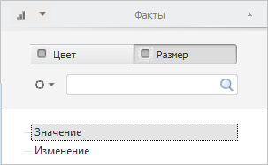
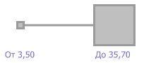

# IVZSizeLegend.Marker

IVZSizeLegend.Marker
-

# IVZSizeLegend.Marker

## Синтаксис

Marker: [VisualizatorSizeMarkerShape](../../Enums/VisualizatorSizeMarkerShape.htm);

## Описание

Свойство Marker определяет фигуру,
 используемую в качестве маркера элемента размерной легенды.

## Комментарии

Для отображения размерной легенды необходимо для измерения [установить роль
 «Метрика»](UiSelection.chm::/Selection/Dimension_type.htm) и на вкладке измерения выбрать переключатель
 «Размер»:

После выполнения указанных действий в пузырьковом дереве появится размерная
 легенда:

## Пример

Для выполнения примера предполагается наличие в репозитории экспресс-отчёта
 с идентификатором EXPRESS, в котором должна быть добавлена размерная легенда
 в пузырьковое дерево.

Добавьте ссылки на системные сборки: Drawing, Express, Metabase, Visualizators.

	Sub UserProc;

	Var

	    Metabase: IMetabase;

	    Analyzer: IEaxAnalyzer;

	    BubbleTree: IVZBubbleTree;

	    SizeLegend: IVZSizeLegend;

	    Style: IVZControlStyle;

	Begin

	    // Получим текущий репозиторий

	    Metabase := MetabaseClass.Active;

	    // Получим экспресс-отчёт

	    Analyzer := Metabase.ItemById("EXPRESS").Edit As IEaxAnalyzer;

	    // Получим пузырьковое дерево

	    BubbleTree := Analyzer.BubbleTree.BubbleTree;

	    // Получим размерную шкалу

	    SizeLegend := BubbleTree.Legends.Item(1) As IVZSizeLegend;

	    // Установим маркер

	    SizeLegend.Marker.Marker := VisualizatorSizeMarkerShape.Rectangle;

	    // Установим максимальное и минимальное значение для шкалы

	    SizeLegend.MinValue := 3.5;

	    SizeLegend.MaxValue := 35.7;

	    // Установим формат подписей для минимального и максимального значения

	    SizeLegend.MinValueFormat := "От {0:0.00}";

	    SizeLegend.MaxValueFormat := "До {0:0.00}";

	    // Установим отступ текста от графических элементов легенды

	    SizeLegend.TextSpacing := 10;

	    // Установим стиль для подписей легенды

	    Style := SizeLegend.Style;

	    Style.FontColor := New GxColor.CreateRGB(102, 98, 227);

	    Style.Font := New GxFont.Create("Tahoma", 12);

	    // Сохраним изменения, сделанные в экспресс-отчёте

	    (Analyzer As IMetabaseObject).Save;

	End Sub UserProc;

В результате выполнения примера для размерной легенды пузырькового дерева
 были установлены маркеры прямоугольной формы, максимальное и минимальное
 значения, а также форматы их записи, отступ подписей от графических элементов
 легенды, равный 10 пикселям:

См. также:

[IVZSizeLegend](IVZSizeLegend.htm)

		Справочная
		 система на версию 10.9
		 от 18/08/2025,
		 © ООО «ФОРСАЙТ»,
