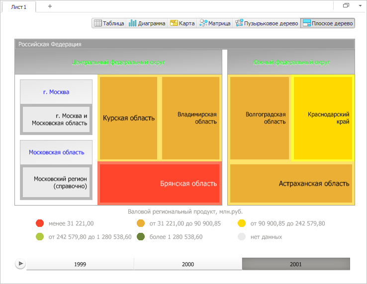

# IVZTreeMap.BranchSpacing

IVZTreeMap.BranchSpacing
-

# IVZTreeMap.BranchSpacing

## Синтаксис

BranchSpacing: Double;

## Описание

Свойство BranchSpacing определяет
 расстояние между ветвями [плоского дерева](IVZTreeMap.htm).

## Пример

Для выполнения примера предполагается наличие в репозитории экспресс-отчёта
 с идентификатором EXP. Модуль, в котором размещается пример, должен иметь
 ссылки на системные сборки Drawing, Express, Metabase и Visualizators.
 Указанная процедура должна вызываться из точки входа Main.

До выполнения примера плоское дерево выглядит так, как показано на странице
 описания интерфейса [IVZTreeMap](IVZTreeMap.htm). Установим
 новые значения следующих свойств плоского дерева: расстояние между ветвями,
 высота области заголовков ветвей, начальный и конечный стили заголовков
 ветвей, максимальный и минимальный размер шрифта текстовых меток, ширина
 границ листьев, уровень измерения, по которому происходит выборка данных.
 Также установим новые значения свойств выравнивания и переноса текста
 текстовых меток, выведем отображаемый уровень иерархии элементов, значение
 маски текста меток элементов дерева и размер коллекции наименований элементов
 плоского дерева:

	Sub UserProc;

	Var

	    Metabase: IMetabase;

	    EaxAnalyzer: IEaxAnalyzer;

	    TreeMap: IVZTreeMap;

	    Captions: IVZItemsNames;

	    LabelsStyle: IVZLabelStyle;

	Begin

	    // Получим текущий репозиторий

	    Metabase := MetabaseClass.Active;

	    // Получим экспресс-отчёт

	    EaxAnalyzer := Metabase.ItemById("EXP").Edit As IEaxAnalyzer;

	    // Получим плоское дерево

	    TreeMap := EaxAnalyzer.TreeMap.TreeMap;

	    // Установим новое значение расстояния между ветвями

	    TreeMap.BranchSpacing := 10;

	    // Установим новое значение высоты области заголовков ветвей

	    TreeMap.CaptionHeight := 50;

	    // Установим новый начальный стиль заголовков ветвей

	    TreeMap.StartHeaderStyle.FontColor := New GxColor.CreateRGB(0, 255, 0);

	    // Установим новый конечный стиль заголовков ветвей

	    TreeMap.EndHeaderStyle.FontColor := New GxColor.CreateRGB(0, 0, 255);

	    // Установим максимальный и минимальный размер шрифта текстовых меток

	    TreeMap.MaxFontSize := 14;

	    TreeMap.MinFontSize := 12;

	    // Установим ширину границ листьев

	    TreeMap.LeafBorderWidth := 5;

	    // Изменим уровень измерения, по которому происходит выборка данных

	    TreeMap.Index := 2;

	    // Получим стиль текстовых меток

	    LabelsStyle := TreeMap.LabelsStyle;

	    // Установим выравнивание текстовых меток

	    LabelsStyle.Alignment := GxStringAlignment.Far;

	    // Установим перенос текста

	    LabelsStyle.TextWrapping := VisualizatorTextWrapping.CharWrap;

	    // Выведем отображаемый уровень иерархии элементов

	    Debug.WriteLine("Отображаемый уровень иерархии элементов: " +

	        TreeMap.HierarchyDepth.ToString);

	    // Выведем маску текста текстовых меток

	    Debug.WriteLine("Маска текста текстовых меток: " + LabelsStyle.MaskText);

	    // Выведем размер коллекции наименований элементов плоского дерева

	    If TreeMap.Captions <> Null Then

	        Debug.WriteLine("Размер коллекции наименований элементов плоского дерева: " +

	            TreeMap.Captions.Count.ToString);

	    End If;

	    // Сохраним экспресс-отчёт

	    (EaxAnalyzer As IMetabaseObject).Save;

	End Sub UserProc;

В результате выполнения примера были изменены следующие свойства плоского
 дерева: расстояние между ветвями, высота области заголовков ветвей,
 начальный и конечный стили заголовков ветвей, максимальный и минимальный
 размер шрифта текстовых меток, ширина границ листьев, уровень измерения,
 по которому происходит выборка данных. Также были изменены значения свойств
 выравнивания и переноса текста текстовых меток:

Также в консоли среды разработки был выведен отображаемый уровень иерархии
 элементов, значение маски текста меток элементов дерева и размер коллекции
 наименований элементов плоского дерева:

Отображаемый уровень иерархии элементов: 3

Маска текста текстовых меток: {%Name}

Размер коллекции наименований элементов плоского
 дерева: 13

См. также:

[IVZTreeMap](IVZTreeMap.htm)

		Справочная
		 система на версию 10.9
		 от 18/08/2025,
		 © ООО «ФОРСАЙТ»,
