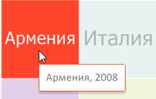
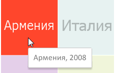

# IVZTreeMap.UseItemColorForToolTipBorder

IVZTreeMap.UseItemColorForToolTipBorder
-

# IVZTreeMap.UseItemColorForToolTipBorder

## Синтаксис

UseItemColorForToolTipBorder: Boolean;

## Описание

Свойство UseItemColorForToolTipBorder
 определяет, будет ли использован цвет элемента для оформления границы
 всплывающей подсказки при наведении на элемент мышкой.

## Комментарии

По умолчанию свойство имеет значение True.

При значении True оформление
 границы всплывающей подсказки равно цвету элемента:

При значении False оформление
 границы всплывающей подсказки выполняется одним цветом, не зависящим от
 цвета элемента:

## Пример

Для выполнения примера предполагается наличие экспресс-отчёта с идентификатором
 EXP, который содержит плоское дерево.

Модуль должен иметь ссылки на системные сборки: Express, Metabase, Vizualizators.

В примере отключается
 зависимость границ всплывающих подсказок от цвета элемента:

	Sub UserProc;

	Var

	    Metabase: IMetabase;

	    EaxAnalyzer: IEaxAnalyzer;

	    TreeMap: IVZTreeMap;

	Begin

	    // Получим текущий репозиторий

	    Metabase := MetabaseClass.Active;

	    // Получим экспресс-отчёт

	    EaxAnalyzer := Metabase.ItemById("EXP").Edit As IEaxAnalyzer;

	    // Получим плоское дерево

	    TreeMap := EaxAnalyzer.TreeMap.TreeMap;

	    // Отключим отображение границ всплывающей подсказки цветом элемента

	    TreeMap.UseItemColorForToolTipBorder := False;

	    (EaxAnalyzer As IMetaBaseObject).Save;

	End Sub UserProc;

В результате выполнения примера границы всплывающих подсказок будут
 отображаться одним цветом, не зависимым от цвета самого элемента.

См. также:

[IVZBubbleTree](../IVZBubbleTree/IVZBubbleTree.htm)

		Справочная
		 система на версию 10.9
		 от 18/08/2025,
		 © ООО «ФОРСАЙТ»,
