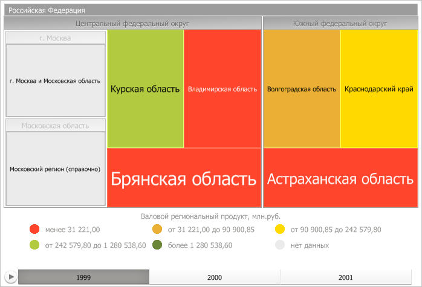

# IVZTreeMap

IVZTreeMap
-

# IVZTreeMap

Сборка: Visualizators;

## Описание

Интерфейс IVZTreeMap предназначен
 для работы с плоским деревом.

## Иерархия наследования

           [IVZInteractable](../IVZInteractable/IVZInteractable.htm)

           [IVZBazeDataVisualizer](../IVZBaseDataVisualizer/IVZBaseDataVisualizer.htm)

           [IVZDataVisualizer](../IVZDataVisualizer/IVZDataVisualizer.htm)

           [IVZTreeDataVisualizer](../IVZTreeDataVisualizer/IVZTreeDataVisualizer.htm)

           IVZTreeMap

## Комментарии

Плоское дерево может иметь следующий вид:

Параметры плоского дерева могут быть получены в свойстве [IEaxTreeMap.TreeMap](KeExpress.chm::/Interface/IEaxTreeMap/IEaxTreeMap.TreeMap.htm).

## Свойства

		 Имя свойства
		 Краткое описание

		 
		 [AnimationTime](IVZTreeMap.AnimationTime.htm)
		 Свойство AnimationTime
		 определяет длительность анимации в секундах.

		 
		 [BranchItemsToolTipStyle](IVZTreeMap.BranchItemsToolTipStyle.htm)
		 Свойство BranchItemsToolTipStyle
		 определяет стиль всплывающих подсказок ветвей плоского
		 дерева.

		 
		 [BranchSpacing](IVZTreeMap.BranchSpacing.htm)
		 Свойство BranchSpacing
		 определяет расстояние между ветвями плоского дерева.

		 
		 [Breadcrumb](IVZTreeMap.Breadcrumb.htm)
		 Свойство Breadcrumb
		 определяет цепочку навигации плоского дерева.

		 
		 [CaptionHeight](IVZTreeMap.CaptionHeight.htm)
		 Свойство CaptionHeight
		 определяет высоту области заголовков ветвей плоского дерева.

		 
		 [Captions](IVZTreeMap.Captions.htm)
		 Свойство Captions определяет
		 коллекцию подписей элементов плоского дерева.

		 
		 [ColorVisual](IVZTreeMap.ColorVisual.htm)
		 Свойство ColorVisual
		 определяет визуализатор сопоставления данных плоского дерева цветам
		 заливки их дочерних элементов.

		 
		 [EndHeaderStyle](IVZTreeMap.EndHeaderStyle.htm)
		 Свойство EndHeaderStyle
		 определяет конечный стиль заголовков ветвей плоского дерева.

		 
		 [HeatMap](IVZTreeMap.HeatMap.htm)
		 Свойство HeatMap определяет
		 возможность размещения корневых и дочерних элементов плоского
		 дерева на одном уровне.

		 
		 [HeightVisual](IVZTreeMap.HeightVisual.htm)
		 Свойство HeightVisual
		 определяет визуализатор для определения высоты дочерних элементов
		 плоского дерева.

		 
		 [HierarchyDepth](IVZTreeMap.HierarchyDepth.htm)
		 Свойство HierarchyDepth
		 определяет отображаемый уровень иерархии элементов плоского дерева.

		 
		 [ItemsToolTipStyle](IVZTreeMap.ItemsToolTipStyle.htm)
		 Свойство ItemsToolTipStyle
		 определяет стиль всплывающих подсказок листьев плоского
		 дерева.

		 
		 [LabelAutoColor](IVZTreeMap.LabelAutoColor.htm)
		 Свойство LabelAutoColor
		 определяет признак, отвечающий за автоматический расчет цвета
		 шрифта подписей листов плоского дерева.

		 
		 [LabelsStyle](IVZTreeMap.LabelsStyle.htm)
		 Свойство LabelsStyle
		 определяет стиль текстовых меток элементов плоского дерева.

		 
		 [LeafBorderWidth](IVZTreeMap.LeafBorderWidth.htm)
		 Свойство LeafBorderWidth
		 определяет ширину границ листьев плоского дерева.

		 
		 [MaxFontSize](IVZTreeMap.MaxFontSize.htm)
		 Свойство MaxFontSize
		 определяет максимальный размер шрифта текстовых меток плоского
		 дерева.

		 
		 [MinFontSize](IVZTreeMap.MinFontSize.htm)
		 Свойство MinFontSize
		 определяет минимальный размер шрифта текстовых меток плоского
		 дерева.

		 
		 [Palette](IVZTreeMap.Palette.htm)
		 Свойство Palette определяет
		 палитру цветов плоского дерева.

		 
		 [RenderMode](IVZTreeMap.RenderMode.htm)
		 Свойство RenderMode
		 определяет режим визуализации плоского дерева.

		 
		 [ShowBranches](IVZTreeMap.ShowBranches.htm)
		 Свойство ShowBranches
		 определяет, будут ли на плоском дереве отображаться родительские
		 элементы измерения объектов наблюдения.

		 
		 [SelectionBorderPen](IVZTreeMap.SelectionBorderPen.htm)
		 Свойство SelectionBorderPen
		 определяет параметры рамки выделения.

		 
		 [SizeVisual](IVZTreeMap.SizeVisual.htm)
		 Свойство SizeVisual
		 определяет визуализатор для определения размеров дочерних элементов
		 плоского дерева.

		 
		 [StartHeaderStyle](IVZTreeMap.StartHeaderStyle.htm)
		 Свойство StartHeaderStyle
		 определяет начальный стиль заголовков ветвей плоского дерева.

		 
		 [TextVisual](IVZTreeMap.TextVisual.htm)
		 Свойство TextVisual
		 определяет визуализатор текста.

		 
		 [UseItemColorForToolTipBorder](IVZTreeMap.UseItemColorForToolTipBorder.htm)
		 Свойство UseItemColorForToolTipBorder
		 определяет, будет ли использован цвет элемента для оформления
		 границы всплывающей подсказки при наведении на элемент мышкой.

		 
		 [UseSelectOnClick](IVZTreeMap.UseSelectOnClick.htm)
		 Свойство UseSelectOnClick
		 определяет, используется ли щелчок кнопкой мыши для выделения
		 родительских элементов.

		 
		 [View3D](IVZTreeMap.View3D.htm)
		 Свойство View3D определяет
		 режим визуализации плоского дерева.

## Свойства, унаследованные от [IVZTreeDataVisualizer](../IVZTreeDataVisualizer/IVZTreeDataVisualizer.htm)

		 Имя свойства
		 Краткое описание

		 
		 [Model](../IVZTreeDataVisualizer/IVZTreeDataVisualizer.Model.htm)

		 Свойство Model определяет
		 модель данных для визуализаторов с древовидной структурой.

## Свойства, унаследованные от [IVZDataVisualizer](../IVZDataVisualizer/IVZDataVisualizer.htm)

		 Имя свойства
		 Краткое описание

		 
		 [DataMappingToLegendAssignment](../IVZDataVisualizer/IVZDataVisualizer.VisualToLegendAssignment.htm)

		 Свойство DataMappingToLegendAssignment
		 определяет привязку данных дерева к легенде.

		 
		 [HoverActiveEffects](../IVZDataVisualizer/IVZDataVisualizer.HoverActiveEffects.htm)

		 Свойство HoverActiveEffects
		 определяет эффекты, которые применяются для элемента, на который
		 была наведена мышь.

		 
		 [HoverInactiveEffects](../IVZDataVisualizer/IVZDataVisualizer.HoverInactiveEffects.htm)

		 Свойство HoverInactiveEffects
		 определяет эффекты, которые применяются для неактивных элементов,
		 на которые не попало наведение мыши.

		 
		 [Index](../IVZDataVisualizer/IVZDataVisualizer.Index.htm)

		 Свойство Index определяет
		 уровень измерения, по которому происходит выборка данных.

		 
		 [Legends](../IVZDataVisualizer/IVZDataVisualizer.Legends.htm)

		 Свойство Legends определяет
		 коллекцию легенд визуализатора.

		 
		 [SelectActiveEffects](../IVZDataVisualizer/IVZDataVisualizer.SelectActiveEffects.htm)

		 Свойство SelectActiveEffects
		 определяет эффекты, которые применяются для выделенных элементов.

		 
		 [SelectInactiveEffects](../IVZDataVisualizer/IVZDataVisualizer.SelectInactiveEffects.htm)

		 Свойство SelectInactiveEffects
		 определяет эффекты, которые применяются для неактивных элементов,
		 которые не попали в выделение.

		 
		 [TimeLine](../IVZDataVisualizer/IVZDataVisualizer.TimeLine.htm)

		 Свойство TimeLine определяет
		 временную шкалу визуализатора.

		 
		 [UseSelectOnRightClick](../IVZDataVisualizer/IVZDataVisualizer.UseSelectOnRightClick.htm)

		 Свойство UseSelectOnRightClick
		 определяет, нужно ли выделять элементы по щелчку правой кнопки
		 мыши.

## Методы, унаследованные от [IVZDataVisualizer](../IVZDataVisualizer/IVZDataVisualizer.htm)

		 Имя метода
		 Краткое описание

		 
		 [LoadFromXml](../IVZDataVisualizer/IVZDataVisualizer.LoadFromXml.htm)

		 Метод LoadFromXml загружает
		 XML-параметры визуализатора: стиль и данные.

		 
		 [LoadStyleFromXml](../IVZDataVisualizer/IVZDataVisualizer.LoadStyleFromXml.htm)

		 Метод LoadStyleFromXml загружает
		 XML-параметры стиля визуализатора.

		 
		 [SaveStyleToXml](../IVZDataVisualizer/IVZDataVisualizer.SaveStyleToXml.htm)

		 Метод SaveStyleToXml сохраняет
		 параметры стиля визуализатора в XML-формате.

		 
		 [SaveToXml](../IVZDataVisualizer/IVZDataVisualizer.SaveToXml.htm)

		 Метод SaveToXml сохраняет
		 параметры визуализатора в XML-формате: стиль
		 и данные.

См. также:

[Интерфейсы сборки
 Visualizators](../KeVisualizators_Interface.htm)

		Справочная
		 система на версию 10.9
		 от 18/08/2025,
		 © ООО «ФОРСАЙТ»,
