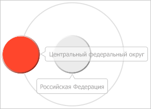

# IVZTreeModel.ActiveItem

IVZTreeModel.ActiveItem
-

# IVZTreeModel.ActiveItem

## Синтаксис

ActiveItem: [IVZTreeItem](../IVZTreeItem/IVZTreeItem.htm);

## Описание

Свойство ActiveItem определяет
 активный элемент в визуализаторе с иерархической структурой.

## Пример

Для выполнения примера предполагается наличие в репозитории экспресс-отчёта
 с идентификатором EXP. Модуль, в котором размещается пример, должен иметь
 ссылки на системные сборки Express, Metabase и Visualizators. Указанная
 процедура должна вызываться из точки входа Main.

До выполнения примера пузырьковое дерево выглядит так, как показано
 на странице описания интерфейса [IVZBubbleTree](../IVZBubbleTree/IVZBubbleTree.htm).
 Определим идентификатор активного элемента пузырькового дерева, после
 чего сделаем активным его родительский элемент:

	Sub UserProc;

	Var

	    Metabase: IMetabase;

	    EaxAnalyzer: IEaxAnalyzer;

	    BubbleTree: IVZBubbleTree;

	    Item: IVZTreeItem;

	    Model: IVZTreeModel;

	    ActiveItem: IVZTreeItem;

	Begin

	    // Получим текущий репозиторий

	    Metabase := MetabaseClass.Active;

	    // Получим экспресс-отчёт

	    EaxAnalyzer := Metabase.ItemById("EXP").Edit As IEaxAnalyzer;

	    // Получим пузырьковое дерево

	    BubbleTree := EaxAnalyzer.BubbleTree.BubbleTree;

	    // Получим модель дерева

	    Model := BubbleTree.Model;

	    // Получим активный элемент пузырькового дерева

	    ActiveItem := Model.ActiveItem;

	    Debug.WriteLine("Идентификатор активного элемента: " +

	        ActiveItem.ID);

	    // Получим корневой элемент

	    Item := ActiveItem.Parent;

	    If Item <> Null Then

	        // Сделаем данный элемент активным

	        Model.SetActiveItem(Item.ID);

	        Debug.WriteLine("Идентификатор нового активного элемента: " +

	            Model.ActiveItem.ID);

	    End If;

	    // Сохраним сделанные изменения в экспресс-отчёте

	    (EaxAnalyzer As IMetabaseObject).Save;

	End Sub UserProc;

В результате выполнения примера активным элементом стал родитель текущего
 активного элемента:

В консоли среды разработки были выведены идентификаторы предыдущего
 и нового активного элемента:

Идентификатор активного элемента: 10001

Идентификатор нового активного элемента: 10000

См. также:

[IVZTreeModel](IVZTreeModel.htm)

		Справочная
		 система на версию 10.9
		 от 18/08/2025,
		 © ООО «ФОРСАЙТ»,
