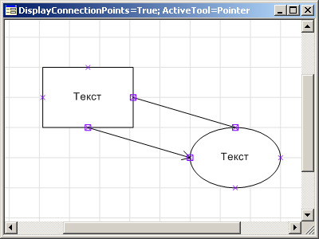
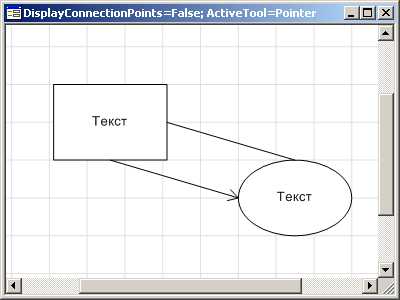

# IWorkspaceBox.DisplayConnectionPoints

IWorkspaceBox.DisplayConnectionPoints
-

# IWorkspaceBox.DisplayConnectionPoints

## Синтаксис

DisplayConnectionPoints: Boolean;

## Описание

Свойство DisplayConnectionsPoint
 определяет признак отображения точек соединения. Если значение данного
 свойства True, то точки соединения
 отображаются, при значении False
 - не отображаются. По умолчанию значение свойства True.

## Пример

 

См. также:

[IWorkspaceBox](IWorkspaceBox.htm)

		Справочная
		 система на версию 10.9
		 от 18/08/2025,
		 © ООО «ФОРСАЙТ»,
