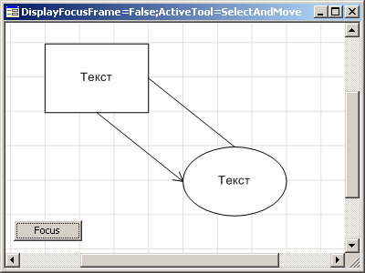

# IWorkspaceBox.DisplayFocusFrame

IWorkspaceBox.DisplayFocusFrame
-

# IWorkspaceBox.DisplayFocusFrame

## Синтаксис

DisplayFocusFrame: Boolean;

## Описание

Свойство DisplayFokusFrame определяет
 признак отображения фокуса. Если значение данного свойства True,
 то фокус отображается, при значении False
 - не отображается. По умолчанию значение свойства True.

## Пример

Для выполнения примера предполагается наличие формы, расположенной на
 ней кнопки с наименованием Button1, компонента WorkspaceBox с наименованием
 WorkspaceBox1 и компонента UiWorkspace, являющегося источником данных
 для компонента WorkspaceBox1.

Добавьте ссылки на системные сборки: Andy, ExtCtrls, Forms, Ui, Workspace.

	Sub Button1OnClick(Sender: Object; Args: IMouseEventArgs);

	    Begin

	        WorkspaceBox1.View.BeginUpdate;

	        WorkspaceBox1.View.FocusedShape := WorkspaceBox1.View.Workspace.Shapes.Item(1);

	        WorkspaceBox1.View.EndUpdate;

	End Sub Button1OnClick;

После выполнения примеров с указанными настройками, при нажатии на кнопку
 получаем следующий результат:

 

См. также:

[IWorkspaceBox](IWorkspaceBox.htm)

		Справочная
		 система на версию 10.9
		 от 18/08/2025,
		 © ООО «ФОРСАЙТ»,
