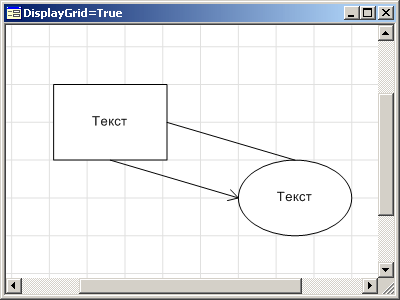
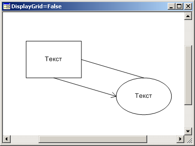

# IWorkspaceBox.DisplayGrid

IWorkspaceBox.DisplayGrid
-

# IWorkspaceBox.DisplayGrid

## Синтаксис

DisplayGrid: Boolean;

## Описание

Свойство DisplayGrid определяет
 признак отображения сетки на рабочем пространстве. Если значение данного
 свойства True, то сетка на рабочем
 пространстве отображается, при значении False
 - не отображается. По умолчанию значение свойства True.

## Пример

 

См. также:

[IWorkspaceBox](IWorkspaceBox.htm)

		Справочная
		 система на версию 10.9
		 от 18/08/2025,
		 © ООО «ФОРСАЙТ»,
