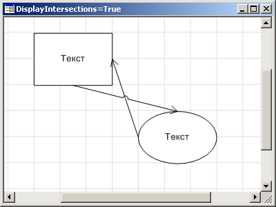
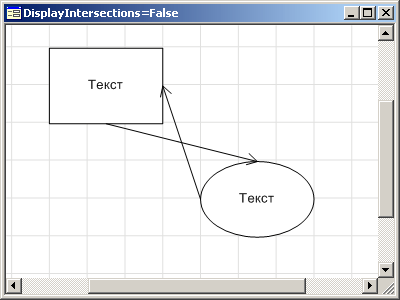

# IWorkspaceBox.DisplayIntersections

IWorkspaceBox.DisplayIntersections
-

# IWorkspaceBox.DisplayIntersections

## Синтаксис

DisplayIntersections: Boolean;

## Описание

Свойство DisplayIntersections
 определяет признак отображения пересечений. Если значение данного свойства
 True, то пересечения отображаются,
 при значении False - не отображаются.
 По умолчанию значение свойства True.

## Пример

 

См. также:

[IWorkspaceBox](IWorkspaceBox.htm)

		Справочная
		 система на версию 10.9
		 от 18/08/2025,
		 © ООО «ФОРСАЙТ»,
