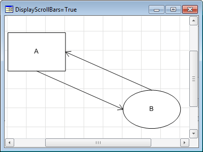
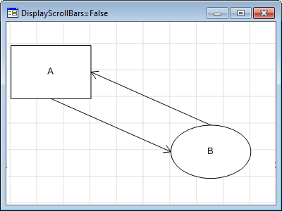

# IWorkspaceBox.DisplayScrollBars

IWorkspaceBox.DisplayScrollBars
-

# IWorkspaceBox.DisplayScrollBars

## Синтаксис

DisplayScrollBars: Boolean;

## Описание

Свойство DisplayScrollBar определяет
 признак отображения полос прокрутки рабочего пространства.

## Комментарии

Если свойству установлено значение True,
 то полосы прокрутки отображаются, иначе не отображаются. По умолчанию
 свойству установлено значение True.

## Пример

 

См. также:

[IWorkspaceBox](IWorkspaceBox.htm)

		Справочная
		 система на версию 10.9
		 от 18/08/2025,
		 © ООО «ФОРСАЙТ»,
