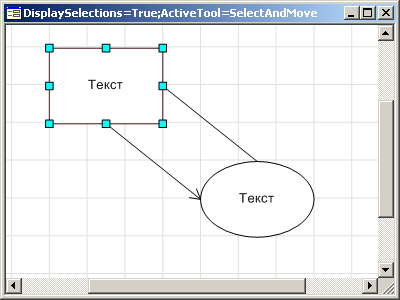
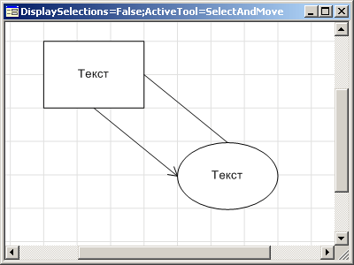

# IWorkspaceBox.DisplaySelections

IWorkspaceBox.DisplaySelections
-

# IWorkspaceBox.DisplaySelections

## Синтаксис

DisplaySelections: Boolean;

## Описание

Свойство DisplaySelections определяет
 признак отображения выделения объектов на рабочем пространстве. Если значение
 данного свойства True, то выделение
 отображается, при значении False
 - не отображается. По умолчанию значение свойства True.

## Пример

 

См. также:

[IWorkspaceBox](IWorkspaceBox.htm)

		Справочная
		 система на версию 10.9
		 от 18/08/2025,
		 © ООО «ФОРСАЙТ»,
