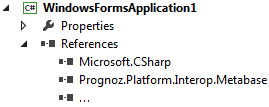

# Работа с системными сборками продукта

Работа с системными сборками продукта
-

# Работа с системными сборками продукта «Форсайт. Аналитическая платформа»

При [подготовке к разработке](../KnowledgeBase_KB000029.htm)
 и установке необходимых дистрибутивов в глобальном кеше сборок регистрируются
 системные Interop-сборки, позволяющие работать с ресурсами «Форсайт. Аналитическая платформа»
 в сторонних средах разработки.

Примечание.
 Сборки будут размещены в подкаталоге GAC_MSIL. Сборки, зависящие от разрядности
 операционной системы, будут размещены в подкаталоге GAC_32, либо GAC_64.

Для каждой сборки в кеше будет создана своя папка, имеющая следующий
 формат наименования: Prognoz.Platform.Interop.<наименование сборки>.
 В подкаталоге, зависящем от разрядности системы, будут размещены сборки
 Prognoz.Platform.Forms.Net и Prognoz.Platform.WInForms.Utils.

Данные сборки также могут использоваться в любой среде, использующей
 платформу .NET Framework. Для работы со сборкой «Форсайт. Аналитическая платформа»
 добавьте ссылку на соответствующую сборку из глобального кеша сборок.
 В коде в области импорта, используя синтаксис выбранного языка, добавьте
 строку для импорта типов выбранной сборки. Это позволит в дальнейшем использовать
 неквалифицированные идентификаторы при обращении к типам.

Примечание.
 Не рекомендуется использовать сборки «Форсайт. Аналитическая платформа»,
 для которых в .NET Framework имеются соответствующие аналоги, так как
 может увеличиться время работы приложения из-за переключения контекстов
 выполнения внутри сборок. Например, используйте System.Xml вместо Prognoz.Platform.Interop.MsXml2
 или System.IO вместо Prognoz.Platform.Interop.ForeIO.

Пример добавленной ссылки на сборку Metabase:

Импорт содержимого сборок Metabase и ForeSystem:

using ...;
using Prognoz.Platform.Interop.Metabase;
using Prognoz.Platform.Interop.ForeSystem;
using ...;
Пример подключения к репозиторию:

IMetabase Mb;
MetabaseManager manager = (new MetabaseManagerFactoryClass()).Active;
IMetabaseDefinitions defs = manager.Definitions;
defs.ReadFromRegistry();
IMetabaseDefinition MbDef = defs.FindById("TEST_REPOSITORY");
StandardSecurityPackage Package = new StandardSecurityPackageClass();
IPasswordCredentials Credentials = (IPasswordCredentials) Package.CreateCredentials(AuthenticationMode.amPassword);
Credentials.UserName = "User";
Credentials.Password = "Password";
Mb = MbDef.OpenDefault(Credentials);
См. также:

[Работа
 в C#](Work_in_CSharp.htm)

		Справочная
		 система на версию 10.9
		 от 18/08/2025,
		 © ООО «ФОРСАЙТ»,
